# IFMIO – C4 Architecture

> Vygenerováno: 2026-03-31
> Na základě: AUDIT_REPORT.md v1.0

---

## Diagram 1: System Context (C4 Level 1)

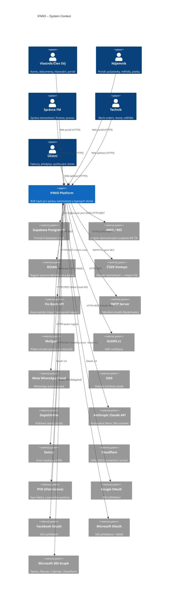

---

## Diagram 2: Container (C4 Level 2)

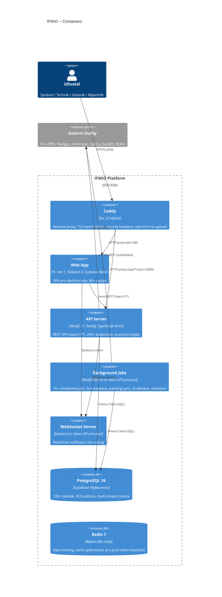

---

## Diagram 3: Component (C4 Level 3) — Auth modul

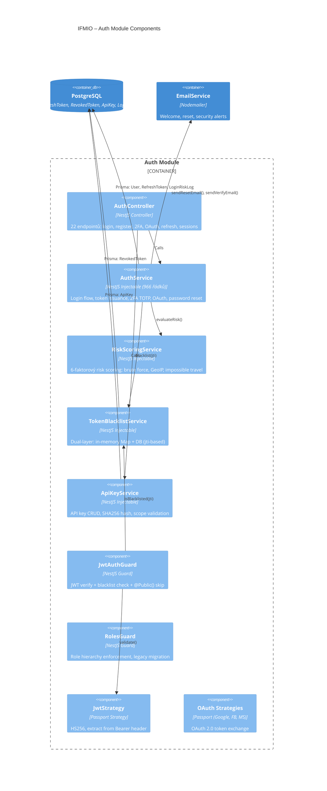

---

## Diagram 3b: Component — Finance modul

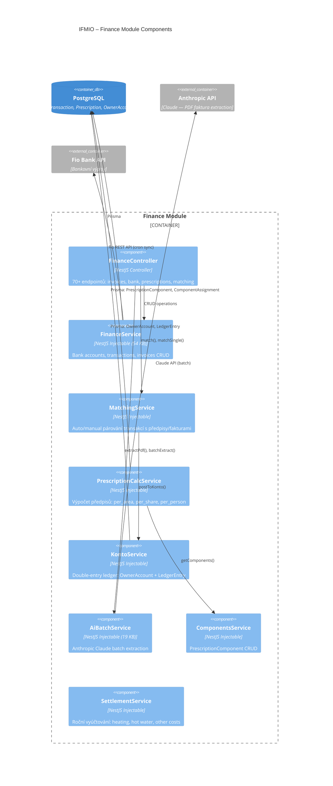

---

## Diagram 3c: Component — Helpdesk modul

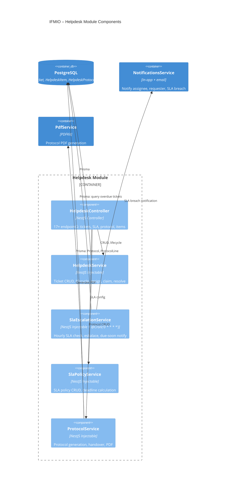

---

## Diagram 3d: Component — Property modul

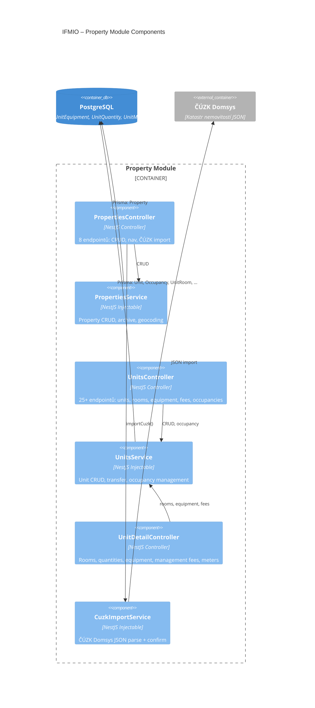

---

## Diagram 3e: Component — Documents modul

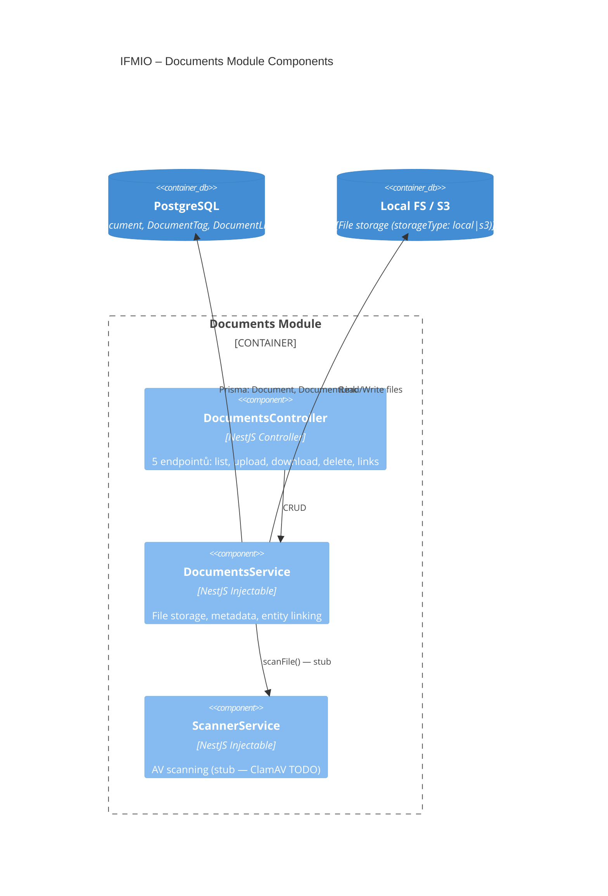

---

## Diagram 4: Deployment (Production)

```mermaid
C4Deployment
    title IFMIO – Production Deployment

    Deployment_Node(cloudflare, "Cloudflare", "DNS + DDoS + Tunnel") {
        Deployment_Node(cf_tunnel, "cloudflared", "Tunnel to origin")
    }

    Deployment_Node(vps, "VPS (Hetzner/similar)", "/opt/ifmio") {
        Deployment_Node(docker, "Docker Compose (prod)") {
            Container(caddy_d, "Caddy v2", "Reverse proxy, TLS, security headers, file upload limits")
            Container(api_d, "ifmio-api", "NestJS + Fastify, Node 20 Alpine, non-root (ifmio:1001), read-only FS")
            Container(web_d, "ifmio-web", "Nginx Alpine, Vite build, SPA routing")
        }
    }

    Deployment_Node(supabase_cloud, "Supabase Cloud", "EU Central") {
        ContainerDb(pg_d, "PostgreSQL 16", "PgBouncer (6543) + Direct (5432)")
    }

    Deployment_Node(ext_services, "External SaaS") {
        Container(sentry_d, "Sentry", "Error tracking + APM")
        Container(anthropic_d, "Anthropic API", "Claude AI")
        Container(fio_d, "Fio Bank API", "Banking sync")
        Container(smtp_d, "SMTP", "Email delivery")
    }

    Rel(cloudflare, caddy_d, "HTTPS")
    Rel(caddy_d, api_d, "HTTP :3000 (/api/*)")
    Rel(caddy_d, web_d, "HTTP :80 (SPA)")
    Rel(api_d, pg_d, "PostgreSQL (PgBouncer)")
    Rel(api_d, sentry_d, "HTTPS events")
    Rel(api_d, anthropic_d, "HTTPS REST")
    Rel(api_d, fio_d, "HTTPS REST (cron)")
    Rel(api_d, smtp_d, "SMTP/TLS")
```

---

## Diagram 5: Data Flows — klíčové business flows

### 5.1 Příchozí faktura (email → AI extrakce → schválení)

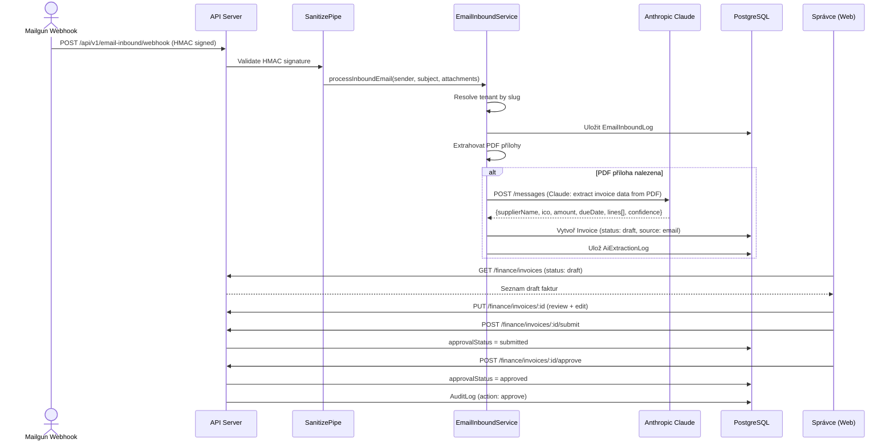

### 5.2 Předpis plateb (nastavení → generování → konto)

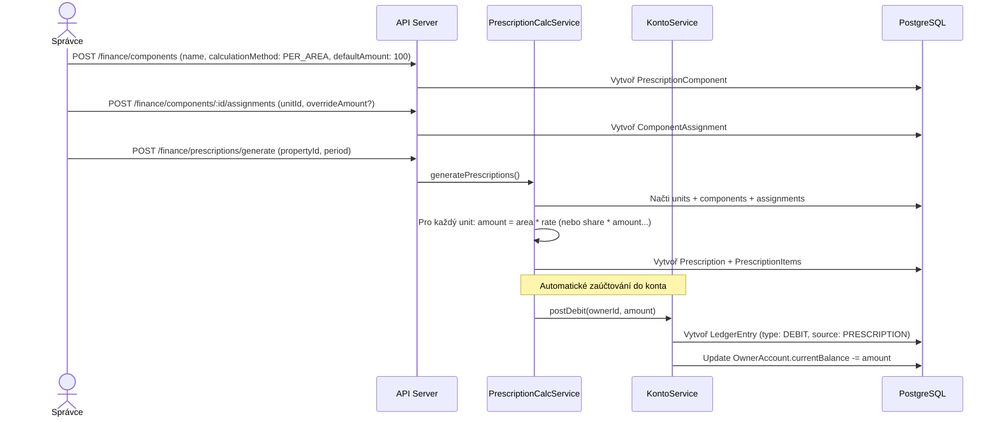

### 5.3 HelpDesk tiket lifecycle

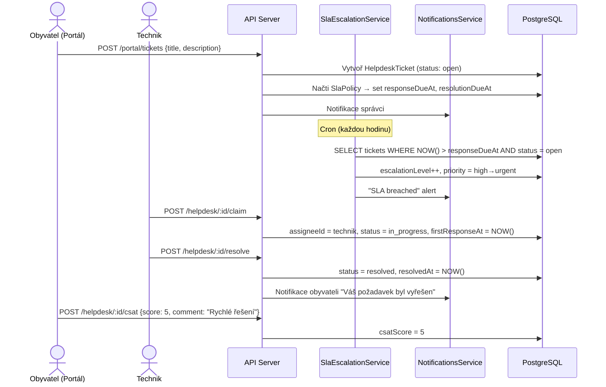

### 5.4 Bankovní výpis (Fio import → párování → konto)

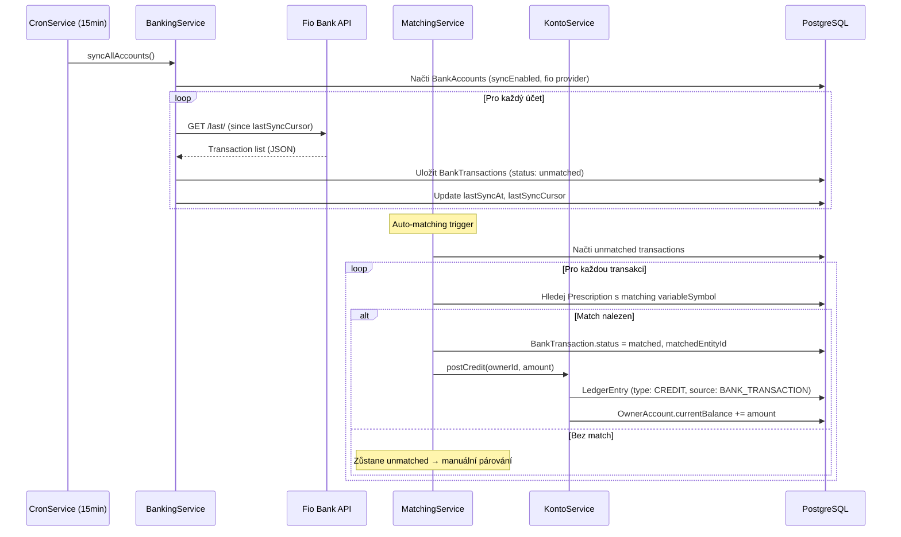

### 5.5 Per rollam hlasování

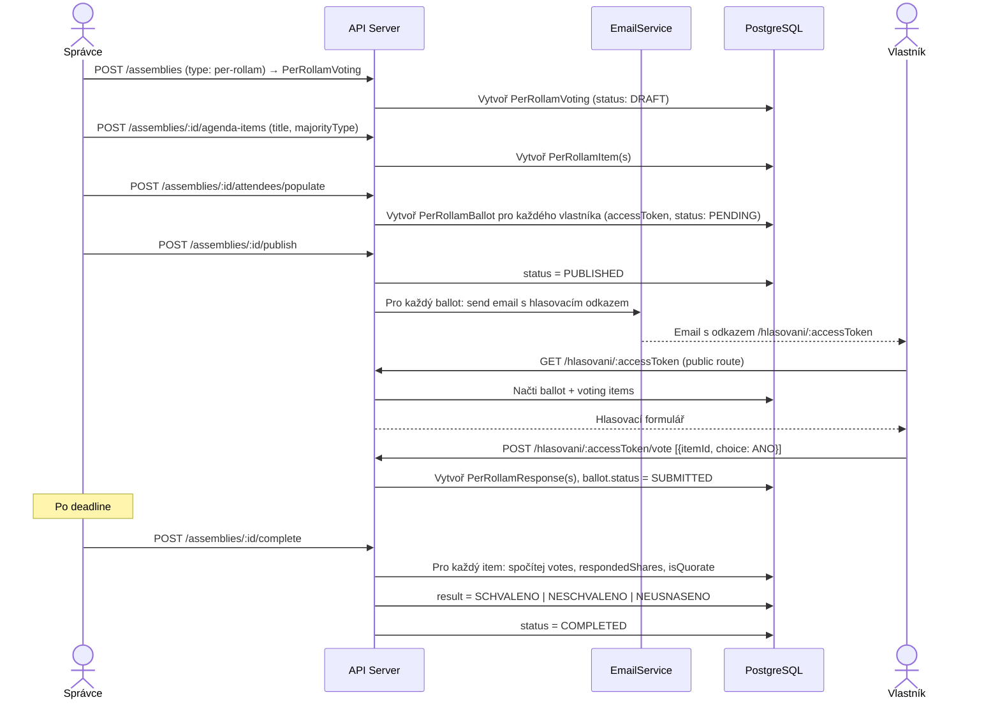

---

## Diagram 6: Security Architecture

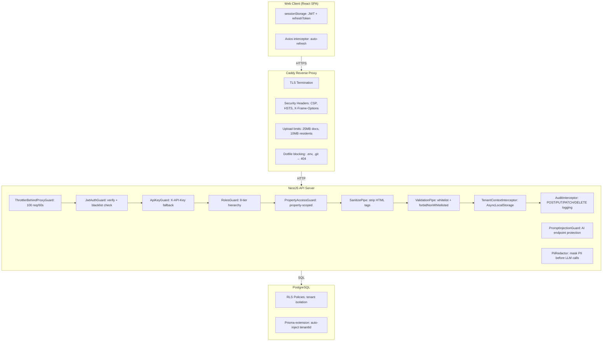

---

*Vygenerováno na základě AUDIT_REPORT.md. Všechny diagramy odpovídají aktuálnímu stavu kódu k 2026-03-31.*
