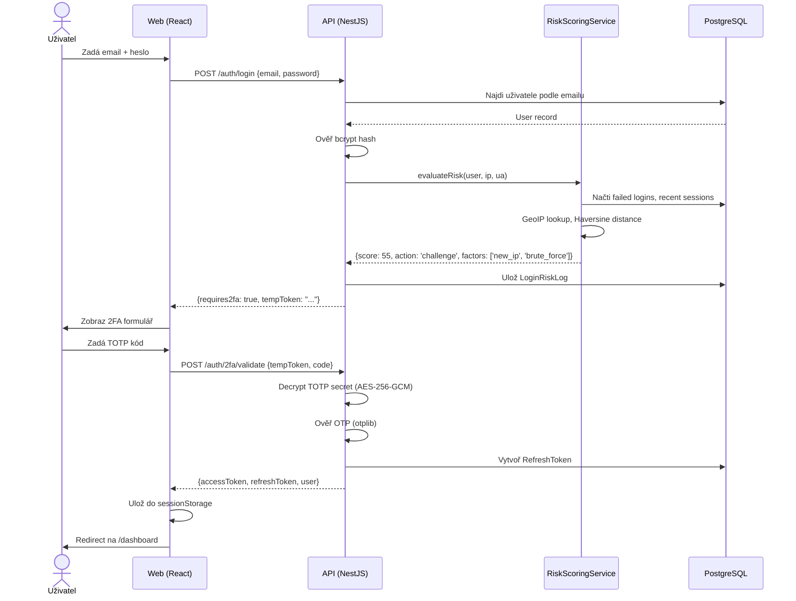
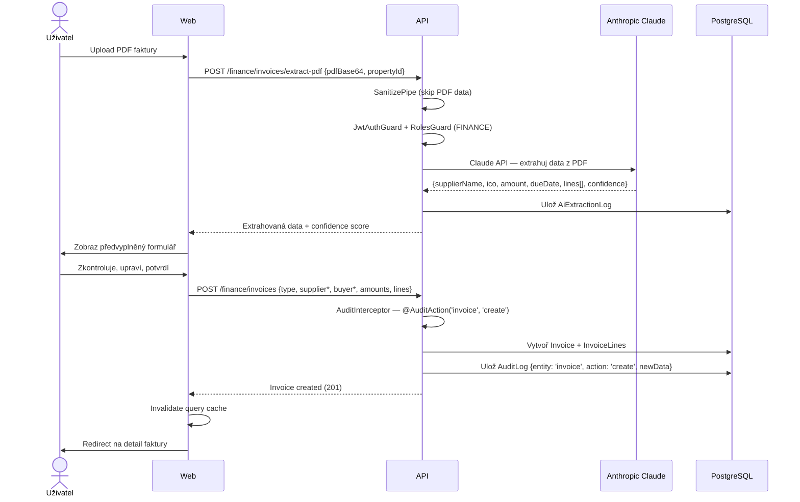
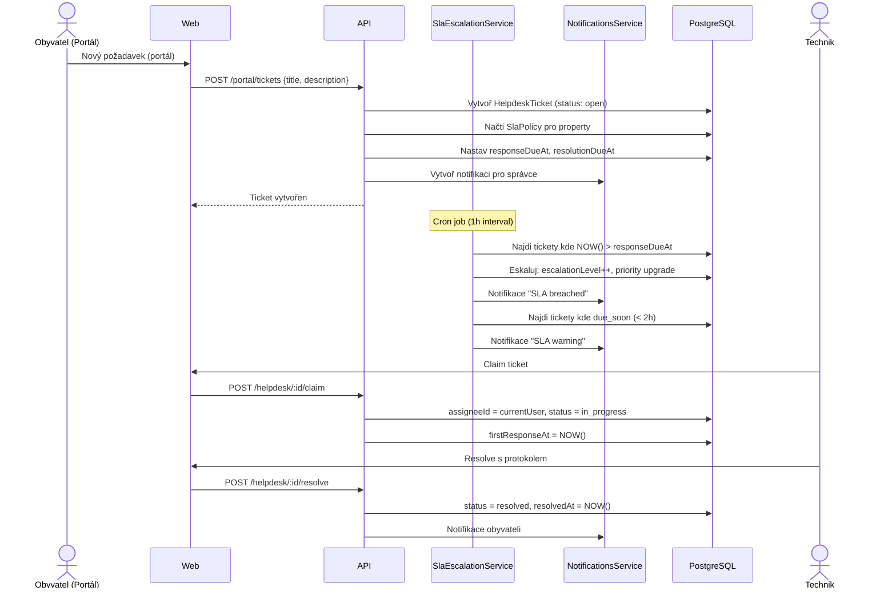
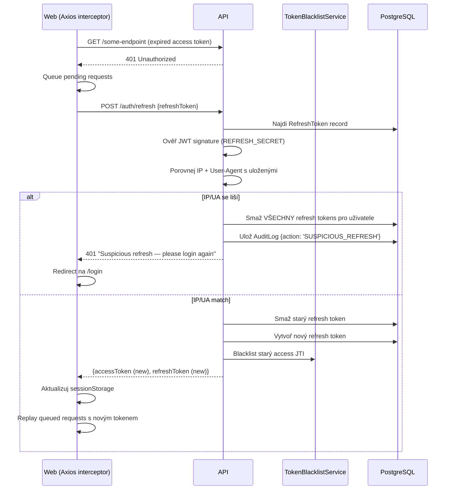

# IFMIO – Audit Report

> Vygenerováno: 2026-03-31
> Verze: 1.0

---

## 1. Executive Summary

IFMIO je komplexní webová platforma pro správu nemovitostí (facility management SaaS), postavená jako monorepo s NestJS API backendem a React SPA frontendem. Projekt je v produkčním stavu s nasazením na vlastním VPS přes Docker Compose + Caddy reverse proxy. Systém pokrývá kompletní životní cyklus správy nemovitostí — od evidence budov a jednotek, přes finanční agendu (fakturace, předpisy, párování plateb, vyúčtování), helpdesk s SLA, revize a protokoly, až po AI asistenta (Mio) s Anthropic Claude API. Bezpečnostní architektura je na vysoké úrovni: multi-tenant izolace (RLS + middleware), JWT s blacklistem, 2FA/TOTP, adaptivní risk scoring, AES-256-GCM šifrování, GDPR compliance. Hlavní rizika: 100+ souborů s `any` typy, několik TODO stub integrací (ISDS, DopisOnline, ClamAV), a token blacklist v paměti (bez Redis pro distribuované nasazení).

---

## 2. Tech Stack & Project Structure

### 2.1 Přehled technologií

| Komponenta | Technologie | Verze |
|---|---|---|
| **Monorepo** | Turborepo + npm workspaces | ^2.0.0 |
| **Runtime** | Node.js | 20 (Alpine) |
| **Jazyk** | TypeScript (strict) | ^5.4 (API), ~5.9 (Web) |
| **Backend** | NestJS + Fastify | ^11.0.1 |
| **ORM** | Prisma | ^6.0.0 |
| **Databáze** | PostgreSQL (Supabase) | 16 |
| **Frontend** | React + Vite | ^19.2 + ^7.3 |
| **Routing** | React Router DOM | ^7.13 |
| **State** | Zustand | ^5.0 |
| **Data fetching** | TanStack React Query | ^5.90 |
| **Styling** | Tailwind CSS v4 | ^4.2 (via @tailwindcss/vite) |
| **Formuláře** | React Hook Form + Zod | ^7.71 + ^4.3 (Web) / ^3.23 (API) |
| **HTTP klient** | Axios | ^1.13 |
| **Ikony** | Lucide React | ^0.577 |
| **i18n** | i18next | ^25.8 |
| **Testy (API)** | Jest | ^30.0 |
| **Testy (Web)** | Vitest | ^4.0 |
| **E2E testy** | Playwright | ^1.50–^1.58 |
| **CI/CD** | GitHub Actions | 4 workflows |
| **Kontejnery** | Docker + Docker Compose | Multi-stage Alpine |
| **Reverse proxy** | Caddy | v2-alpine |
| **Monitoring** | Sentry | ^10.43 |
| **Logging** | Pino (nestjs-pino) | ^4.6 |
| **AI** | Anthropic SDK (Claude) | ^0.78 |
| **Email** | Nodemailer | ^8.0 |
| **PDF** | PDFKit | ^0.17 |
| **WebSockets** | Socket.io | ^4.8 |

### 2.2 Adresářový strom (3 úrovně)

```
ifmio/
├── .github/
│   └── workflows/               # CI, Deploy, E2E, Smoke workflows
├── apps/
│   ├── api/                     # NestJS backend (Fastify, Prisma)
│   │   ├── prisma/              # Schema, migrace, seed
│   │   └── src/                 # Moduly, controllers, services
│   ├── e2e/                     # Playwright E2E testy (46 suites)
│   └── web/                     # React SPA (Vite, Tailwind)
│       ├── e2e/                 # Web-level E2E testy
│       └── src/                 # Moduly, komponenty, stores
├── packages/
│   ├── shared-types/            # Sdílené TypeScript typy
│   └── validation/              # Sdílená Zod validační schémata
├── docs/
│   └── runbooks/                # Provozní příručky (rollback, backup, RLS, AI)
├── scripts/                     # Build/dev skripty
├── supabase/
│   └── migrations/              # Supabase-specific migrace
├── tools/
│   └── sunvote-bridge/          # Hardware voting bridge
├── docker-compose.yml           # Dev: PostgreSQL 16 + Redis 7
├── docker-compose.prod.yml      # Prod: API + Web + Caddy + Cloudflared
├── Caddyfile                    # Reverse proxy, SSL, security headers
├── turbo.json                   # Turbo pipeline konfigurace
└── package.json                 # Root workspace definice
```

### 2.3 Workspace struktura

| Workspace | Popis |
|---|---|
| `apps/api` (`@ifmio/api`) | NestJS API server — 48+ feature modulů |
| `apps/web` (`ifmio-app`) | React SPA — 50+ stránek/routes |
| `apps/e2e` (`@ifmio/e2e`) | Playwright E2E test suite |
| `packages/shared-types` (`@ifmio/shared-types`) | Sdílené TS typy (auth, finance, property, resident) |
| `packages/validation` (`@ifmio/validation`) | Zod schémata (login, register, property, resident, finance) |

### 2.4 Klíčové konfigurační soubory

| Soubor | Účel |
|---|---|
| `apps/api/tsconfig.json` | TS strict, nodenext, ES2023, path aliases |
| `apps/web/tsconfig.app.json` | TS strict, noUnusedLocals/Params, react-jsx |
| `apps/api/eslint.config.mjs` | ESLint 9 flat config + Prettier + TS typed checking |
| `apps/web/eslint.config.js` | ESLint 9 + react-hooks + react-refresh |
| `apps/api/.prettierrc` | singleQuote, trailingComma: all |
| `apps/web/vite.config.ts` | Tailwind plugin, manual chunks (vendor split) |
| `turbo.json` | Build pipeline: build → dev, lint, type-check, test |
| `.env.example` | Root env template (DB, JWT, SMTP, Caddy) |
| `apps/api/.env.example` | API env (96 proměnných — viz Appendix) |
| `apps/web/.env.example` | Web env (VITE_API_URL, Sentry) |

---

## 3. Data Model & Database

### 3.1 Přehled

- **ORM**: Prisma v6 se schématem `apps/api/prisma/schema.prisma` (~155 KB)
- **Databáze**: PostgreSQL 16 (Supabase — PgBouncer port 6543, Direct port 5432)
- **Modelů**: 100+ (viz Appendix pro kompletní seznam)
- **Migrací**: 25+ inkrementálních migrací od baseline `20260308000000`
- **RLS**: Row-Level Security policies na všech tabulkách (defense-in-depth)
- **Seed**: `prisma/migrations/seed-principal-layer.ts` (datová migrace principal vrstvy)

### 3.2 Klíčové doménové oblasti

#### Tenant & Uživatelé
- `Tenant` — Multi-tenant root (plan: free/starter/pro/enterprise, retention konfigurace)
- `TenantSettings` — Konfigurace organizace (logo, timezone, jazyk, emailFrom, onboarding)
- `User` — 8 rolí (tenant_owner → unit_tenant), 2FA/TOTP, OAuth, password policy
- `RefreshToken`, `RevokedToken`, `ApiKey`, `LoginRiskLog` — Security vrstva

#### Nemovitosti & Jednotky
- `Property` — Budova/nemovitost (type: bytdum/roddum/komer/..., ownership: vlastnictvi/druzstvo/pronajem)
- `Unit` — Jednotka s detailními parametry (area, spaceType, heatingCoef, cadastralData)
- `UnitRoom`, `UnitQuantity`, `UnitEquipment`, `UnitManagementFee` — Detail jednotky
- `Resident`, `Occupancy` — Obyvatelé a historie obsazení

#### Finance
- `Invoice` — Faktura (7 typů, approval workflow: draft→submitted→approved, AI extraction)
- `BankAccount`, `BankTransaction` — Bankovní účty + transakce (Fio API sync)
- `Prescription`, `PrescriptionComponent` — Předpisy plateb + komponenty
- `OwnerAccount`, `LedgerEntry` — Konto vlastníka (double-entry accounting)
- `Settlement`, `SettlementItem`, `SettlementCost` — Roční vyúčtování
- `PaymentOrder` — Platební příkazy
- `Reminder`, `KontoReminder` — Upomínky (3 stupně)

#### Provoz
- `HelpdeskTicket` — Požadavky (SLA tracking, eskalace, recurring plans)
- `WorkOrder` — Pracovní příkazy (dispatch to supplier, CSAT)
- `Protocol`, `ProtocolLine` — Protokoly předání/oprav
- `RevisionSubject`, `RevisionType`, `RevisionPlan`, `RevisionEvent` — Revize a compliance
- `Asset`, `AssetType`, `AssetServiceRecord` — Evidence majetku
- `AssetQrCode`, `AssetQrScanEvent`, `AssetFieldCheckExecution` — QR a field checks
- `RecurringActivityPlan` — Plánované údržby (calendar/from_completion mode)

#### Správa & Governance
- `Party` — Univerzální identita (osoba/firma/SVJ)
- `Principal`, `ManagementContract`, `FinancialContext` — Obchodní vztahy a účetní kontexty
- `Assembly`, `AssemblyAgendaItem`, `AssemblyVote` — Shromáždění SVJ + hlasování
- `PerRollamVoting`, `PerRollamBallot`, `PerRollamResponse` — Per rollam hlasování
- `HardwareVotingSession` — Hardwarové hlasovací zařízení (keypady)

#### Komunikace & Dokumenty
- `Document`, `DocumentLink`, `DocumentTag` — DMS s vazbami na entity
- `OutboxLog` — Multi-channel komunikace (email/sms/letter/isds/whatsapp)
- `Notification` — In-app notifikace
- `ChatMessage`, `ChatMention`, `Activity` — Interní komunikace

#### AI (Mio)
- `MioFinding`, `MioDigestLog`, `MioJobRunLog` — AI detekce a digestu
- `MioWebhookSubscription`, `MioWebhookDeliveryLog`, `MioWebhookOutbox` — Webhook outbox
- `MioConversation`, `MioMessage` — Konverzační AI rozhraní

### 3.3 Enum typy (výběr)

| Enum | Hodnoty |
|---|---|
| `UserRole` | tenant_owner, tenant_admin, finance_manager, property_manager, operations, viewer, unit_owner, unit_tenant |
| `TenantPlan` | free, starter, pro, enterprise |
| `PropertyType` | bytdum, roddum, komer, prumysl, pozemek, garaz |
| `OwnershipType` | vlastnictvi, druzstvo, pronajem |
| `InvoiceType` | received, issued, proforma, credit_note, internal |
| `ApprovalStatus` | draft, submitted, approved |
| `TicketStatus` | open, in_progress, resolved, closed |
| `TicketPriority` | low, medium, high, urgent |
| `WorkOrderStatus` | nova, v_reseni, vyresena, uzavrena, zrusena |
| `AssetCategory` | tzb, stroje, vybaveni, vozidla, it, ostatni |
| `MeterType` | elektrina, voda_studena, voda_tepla, plyn, teplo |
| `Channel` | email, sms, letter, isds, whatsapp |

### 3.4 ER Diagram (zjednodušený — hlavní entity)

```mermaid
erDiagram
    Tenant ||--o{ User : has
    Tenant ||--o{ Property : owns
    Tenant ||--o{ TenantSettings : configures
    Tenant ||--o{ TenantInvitation : sends

    User ||--o{ RefreshToken : has
    User ||--o{ ApiKey : creates
    User ||--o{ LoginRiskLog : generates

    Property ||--o{ Unit : contains
    Property ||--o{ BankAccount : has
    Property ||--o{ HelpdeskTicket : receives
    Property ||--o{ Asset : tracks
    Property ||--o{ RevisionPlan : schedules
    Property ||--o{ Assembly : hosts
    Property ||--o{ CalendarEvent : schedules
    Property ||--o{ Settlement : settles

    Unit ||--o{ Occupancy : has
    Unit ||--o{ UnitRoom : contains
    Unit ||--o{ UnitEquipment : equips
    Unit ||--o{ Meter : measures

    Resident ||--o{ Occupancy : occupies
    Resident ||--o{ PortalAccess : accesses
    Resident ||--o{ Reminder : receives

    Invoice ||--o{ InvoiceCostAllocation : allocates
    Invoice ||--o{ InvoiceComment : discusses

    BankAccount ||--o{ BankTransaction : records
    BankTransaction }o--o| Prescription : matches

    Prescription ||--o{ PrescriptionItem : contains
    PrescriptionComponent ||--o{ PrescriptionItem : defines
    PrescriptionComponent ||--o{ ComponentAssignment : assigns

    OwnerAccount ||--o{ LedgerEntry : ledger

    HelpdeskTicket ||--o{ WorkOrder : spawns
    HelpdeskTicket ||--o{ HelpdeskItem : items
    HelpdeskTicket ||--o{ Protocol : documents

    Asset ||--o{ AssetServiceRecord : serviced
    Asset ||--o{ AssetQrCode : labeled
    Asset ||--o{ RevisionPlan : planned

    RevisionPlan ||--o{ RevisionEvent : executed

    Party ||--o{ Principal : represents
    Principal ||--o{ ManagementContract : contracts
    ManagementContract ||--o{ FinancialContext : scopes

    Assembly ||--o{ AssemblyAgendaItem : agenda
    AssemblyAgendaItem ||--o{ AssemblyVote : votes
    Assembly ||--o{ AssemblyAttendee : attends

    MioConversation ||--o{ MioMessage : contains
```



### 3.5 Nalezené nesrovnalosti

| # | Typ | Popis | Doporučení |
|---|---|---|---|
| 1 | Index | `BankTransaction` — vysoký objem dat, párování podle variabilního symbolu může být pomalé bez dedikovaného indexu na `variableSymbol + tenantId` | Přidat compound index |
| 2 | Konzistence | Mix `String @id @default(uuid())` (TEXT) a `@db.Uuid` — viz MEMORY migration rules | Důsledně dokumentovat v schema |
| 3 | Nepoužívané modely | `FinanceTransaction` (starý model) — nahrazen `BankTransaction` + `Invoice` | Zvážit odstranění po verifikaci |

---

## 4. API Layer

### 4.1 Globální konfigurace

**Soubor:** `apps/api/src/main.ts`

| Vrstva | Detail |
|---|---|
| **HTTP server** | FastifyAdapter s pino logováním |
| **Prefix** | `/api/v1` |
| **Security headers** | Helmet (CSP, HSTS, CORS) |
| **Globální pipes** | SanitizePipe → ValidationPipe (whitelist + forbidNonWhitelisted) |
| **Globální filter** | HttpExceptionFilter (Sentry + české chybové zprávy) |
| **Rate limiting** | 100 req/60s (ThrottlerBehindProxyGuard, proxy-aware) |
| **Upload limit** | 20 MB (multipart) |
| **Globální guards** | JwtAuthGuard → RolesGuard → PropertyAccessGuard |
| **Globální interceptory** | TenantContextInterceptor → AuditInterceptor → SensitiveReadInterceptor |

### 4.2 Endpointy podle domén

#### Auth (`/auth/*`) — 22 endpointů

| Metoda | Cesta | Auth | Throttle | Popis |
|---|---|---|---|---|
| POST | `/auth/register` | Public | 5/min | Registrace tenant + owner |
| POST | `/auth/login` | Public | 5/min | Přihlášení |
| POST | `/auth/logout` | JWT | — | Odhlášení (blacklist token) |
| GET | `/auth/me` | JWT | — | Aktuální uživatel + tenant |
| GET | `/auth/me/avatar` | JWT | — | Avatar (base64) |
| PATCH | `/auth/profile` | JWT | — | Aktualizace profilu |
| PATCH | `/auth/change-password` | JWT | — | Změna hesla |
| POST | `/auth/refresh` | Public | 10/min | Refresh token |
| POST | `/auth/verify-email` | Public | — | Ověření emailu |
| POST | `/auth/forgot-password` | Public | 3/min | Požadavek na reset |
| POST | `/auth/reset-password` | Public | 5/min | Nastavení nového hesla |
| GET | `/auth/invitation-info/:token` | Public | — | Info o pozvánce |
| POST | `/auth/accept-invitation` | Public | 5/min | Přijetí pozvánky |
| GET | `/auth/sessions` | JWT | — | Aktivní session |
| DELETE | `/auth/sessions/:id` | JWT | — | Zrušení konkrétní session |
| DELETE | `/auth/sessions` | JWT | — | Zrušení všech ostatních |
| GET | `/auth/login-history` | JWT | — | Historie přihlášení |
| POST | `/auth/2fa/setup` | JWT | — | Inicializace TOTP |
| POST | `/auth/2fa/verify` | JWT | — | Aktivace TOTP |
| POST | `/auth/2fa/disable` | JWT | — | Deaktivace TOTP |
| POST | `/auth/2fa/validate` | Public | 5/min | 2FA ověření při loginu |
| POST | `/auth/oauth/token` | Public | 10/min | OAuth token exchange |

#### API Keys (`/api-keys/*`) — 5 endpointů

| Metoda | Cesta | Role | Popis |
|---|---|---|---|
| GET | `/api-keys` | MANAGE | Seznam API klíčů |
| POST | `/api-keys` | MANAGE | Vytvoření klíče |
| POST | `/api-keys/:id/revoke` | MANAGE | Odvolání klíče |
| DELETE | `/api-keys/:id` | MANAGE | Smazání klíče |
| GET | `/api-keys/scopes` | MANAGE | Dostupné scopes |

#### Properties (`/properties/*`) — 8 endpointů

| Metoda | Cesta | Role | Popis |
|---|---|---|---|
| POST | `/properties` | MANAGE | Vytvoření nemovitosti |
| GET | `/properties` | — | Seznam nemovitostí |
| GET | `/properties/:id` | — | Detail |
| GET | `/properties/:id/nav` | — | Navigace (prev/next) |
| PATCH | `/properties/:id` | WRITE | Aktualizace |
| DELETE | `/properties/:id` | MANAGE | Archivace (soft delete) |
| POST | `/properties/import/cuzk` | MANAGE | ČÚZK import (parse) |
| POST | `/properties/import/cuzk/confirm` | MANAGE | ČÚZK import (uložení) |

#### Units (`/properties/:propertyId/units/*`) — 25+ endpointů

| Metoda | Cesta | Role | Popis |
|---|---|---|---|
| GET/POST | `.../units` | —/WRITE | CRUD jednotek |
| GET/PUT/DELETE | `.../units/:id` | —/WRITE/MANAGE | Detail/update/delete |
| POST | `.../units/:unitId/occupancies` | WRITE | Přidání obyvatele |
| PATCH | `.../occupancies/:id/end` | WRITE | Ukončení obsazení |
| POST | `.../units/:unitId/transfer` | WRITE | Převod vlastnictví |
| GET/POST/PUT/DELETE | `.../units/:unitId/rooms` | — / WRITE | Plochy (místnosti) |
| GET/POST/DELETE | `.../units/:unitId/quantities` | — / WRITE | Veličiny |
| GET/POST/PUT/DELETE | `.../units/:unitId/equipment` | — / WRITE | Vybavení |
| GET/POST/PUT/DELETE | `.../units/:unitId/management-fees` | — / WRITE | Poplatky za správu |
| GET | `.../units/:unitId/meters` | — | Měřidla jednotky |
| GET | `.../units/:unitId/prescription-components` | — | Komponenty předpisů |

#### Residents (`/residents/*`) — 11 endpointů

| Metoda | Cesta | Role | Popis |
|---|---|---|---|
| GET | `/residents` | — | Seznam (stránkování, tenant-scoped) |
| GET | `/residents/debtors` | — | Dlužníci |
| GET | `/residents/:id` | — | Detail s historií |
| GET | `/residents/:id/invoices` | — | Faktury obyvatele |
| POST | `/residents` | WRITE | Vytvoření |
| PUT | `/residents/:id` | WRITE | Aktualizace |
| DELETE | `/residents/:id` | MANAGE | Soft delete |
| POST | `/residents/bulk/deactivate` | MANAGE | Hromadná deaktivace |
| POST | `/residents/bulk/activate` | MANAGE | Hromadná aktivace |
| POST | `/residents/bulk/assign-property` | WRITE | Hromadné přiřazení |
| POST | `/residents/bulk/mark-debtors` | MANAGE | Označení dlužníků |

#### Finance (`/finance/*`) — 70+ endpointů

**Bankovní účty (6):** CRUD + PDF výpis + statement
**Transakce (8):** Seznam, export CSV/XLSX, vytvoření, import CSV/ABO, auto-match, manual match, unmatch, split, delete
**Předpisy (6):** CRUD, generate, bulk send
**Faktury (40+):** Kompletní lifecycle včetně:
- AI PDF extraction (`extract-pdf`, `batch-extract`)
- ISDOC import (single + bulk)
- Approval workflow (submit, approve, return-to-draft)
- Párování s transakcemi
- QR platební kód (SPAYD)
- Export ISDOC XML
- Alokace nákladů (CRUD)
- Komentáře, historie změn, tagy
- Kopírování (jednorázové + recurring)
**Billing periods (2):** Seznam + vytvoření
**Training data (2):** Stats + NDJSON export
**Summary (1):** Přehled

#### Helpdesk (`/helpdesk/*`) — 17+ endpointů

| Metoda | Cesta | Role | Popis |
|---|---|---|---|
| GET | `/helpdesk` | — | Seznam ticketů |
| GET | `/helpdesk/sla-stats` | — | SLA metriky |
| GET | `/helpdesk/dashboard` | — | KPI dashboard |
| GET/POST/DELETE | `/helpdesk/sla-policies` | OPS | Správa SLA politik |
| POST | `/helpdesk` | OPS | Vytvoření ticketu |
| GET/PUT/DELETE | `/helpdesk/:id` | —/OPS | Detail/update/delete |
| POST | `/helpdesk/:id/assign` | OPS | Přiřazení |
| POST | `/helpdesk/:id/claim` | OPS | Self-assign |
| POST | `/helpdesk/:id/resolve` | OPS | Quick resolve |
| POST/DELETE | `.../items` | OPS | Položky protokolu |
| POST/GET | `.../protocol` | OPS/— | Protokol |
| POST | `.../work-orders` | OPS | Vytvoření WO z ticketu |
| POST | `.../dispatch` | OPS | Dispatch dodavateli |
| POST | `.../confirm|decline|complete|csat` | — | Supplier/CSAT flow |

#### Work Orders (`/work-orders/*`) — 10 endpointů

| Metoda | Cesta | Role | Popis |
|---|---|---|---|
| GET | `/work-orders` | — | Seznam |
| GET | `/work-orders/stats` | — | Statistiky |
| GET | `/work-orders/my-agenda` | — | Denní agenda technika |
| GET/POST/PUT/DELETE | `/work-orders/:id` | —/OPS | CRUD |
| PUT | `/work-orders/:id/status` | OPS | Změna statusu |
| GET | `/work-orders/:id/completion-status` | — | Stav plnění |
| POST | `/work-orders/:id/comments` | OPS | Komentář |

#### Assets (`/assets/*`) — 14 endpointů

CRUD + service records, sync plans, passport, revision history, audit events, export CSV

#### Assemblies (`/assemblies/*`) — 22+ endpointů

CRUD + status transitions (publish, start, complete, cancel), agenda items (CRUD + reorder), attendance (CRUD + populate), quorum check, voting (record + evaluate), PDF reports (minutes, attendance, voting, garage authorization)

#### Admin (`/admin/*`) — 20+ endpointů

Onboarding (status, skip, dismiss), tenant info, settings (CRUD + logo upload), user management (CRUD + invite + role change + force password), property assignments, invitations, email test, data export

#### GDPR (`/admin/gdpr/*`) — 3 endpointy

Erasure (Article 17), export (Article 20), erasure log

#### Portal (`/portal/*`) — 16 endpointů

My units/prescriptions/settlements/tickets/meters/documents/konto + admin management (generate/bulk-generate/refresh/revoke access, send invitation)

#### Další moduly

- **Documents** (`/documents/*`) — 5 endpointů: CRUD + download + link
- **Audit** (`/audit/*`) — 2 endpointy: seznam + entity values
- **Contracts** (`/contracts/*`) — 7 endpointů: CRUD + stats + terminate
- **Reminders** (`/reminders/*`) — 10 endpointů: templates, debtors, CRUD, bulk, send/paid, preview
- **Meters** (`/meters/*`) — 12 endpointů: CRUD + readings + initial/bulk readings
- **Dashboard** (`/dashboard/*`) — 3 endpointy: overview, operational, badges
- **Search** (`/search`) — 1 endpoint: global search
- **Notifications** (`/notifications/*`) — 5 endpointů: CRUD + unread count + generate
- **Health** (`/health`) — 1 public endpoint: DB connectivity check

### 4.3 Nalezené problémy API vrstvy

| # | Problém | Závažnost | Detail |
|---|---|---|---|
| 1 | Assets nemají role guard na CRUD | LOW | POST/PATCH/DELETE `/assets` nemají explicitní `@Roles()` — spoléhají na globální JWT guard |
| 2 | 4 soubory používají `$queryRaw`/`$executeRaw` | LOW | Pouze v admin/test kontextech (health, cron, RLS test, konto) — Prisma parametrizuje |

---

## 5. Frontend & UI

### 5.1 Architektura

- **Entry point:** `apps/web/src/main.tsx` — React s providery (Helmet, QueryClient, Toast, ConfirmDialog, Router)
- **Layout:** `AppShell.tsx` — Sidebar + TopBar + Content area
- **Routing:** React Router v7 `createBrowserRouter` s locale-aware public routes
- **Stav:** Zustand stores (auth, property picker, tenant) + React Query cache
- **API klient:** Axios s interceptory (auth header, token refresh s queue)

### 5.2 Sitemap — kompletní hierarchie routes

#### Veřejné stránky (s locale prefixem `/:locale/`)
```
/:locale/                      → LandingPage
/:locale/cenik | /pricing      → PricingPage
/:locale/demo                  → DemoPage
/:locale/kontakt | /contact    → ContactPage
/:locale/reseni/:slug          → SolutionPage
/:locale/platforma/:slug       → PlatformModulePage
/:locale/partneri/registrace   → PartnerRegisterPage
/:locale/partneri/:type        → PartnerSearchPage
/:locale/o-nas | /about        → AboutPage
/:locale/kariera | /careers    → CareersPage
/:locale/blog                  → BlogPage
/:locale/pravni-dokumenty      → LegalDocsPage
/:locale/bezpecnost            → SecurityPage
```

#### Auth stránky (bez locale)
```
/login                → LoginPage (email/password + 2FA TOTP/backup codes)
/register             → RegisterPage (4-step wizard)
/verify-email         → VerifyEmailPage
/forgot-password      → ForgotPasswordPage
/reset-password       → ResetPasswordPage
/accept-invitation    → AcceptInvitationPage
/auth/callback        → OAuthCallbackPage
/q/:token             → QrResolvePage
/hlasovani/:token     → PublicBallotPage
/terms, /privacy, /gdpr, /cookies → Legal pages
```

#### Chráněné stránky (AppShell layout)
```
/dashboard                                    → DashboardPage (role-aware)
/onboarding                                   → OnboardingPage

── Portál (unit_owner/unit_tenant) ──
/portal                                       → PortalPage
/portal/units|prescriptions|settlements       → My* stránky
/portal/tickets|meters|documents|konto        → My* stránky

── Nemovitosti ──
/properties                                   → PropertiesPage
/properties/:id                               → PropertyDetailPage
/properties/:id/units/:unitId                 → UnitDetailPage
/properties/:id/assemblies                    → AssemblyListPage
/properties/:id/assemblies/:id                → AssemblyDetailPage
/properties/:id/assemblies/:id/live           → LiveDashboardPage (hlasování)
/properties/:id/per-rollam                    → PerRollamListPage
/properties/:id/per-rollam/:id               → PerRollamDetailPage

── Provoz ──
/helpdesk                                     → HelpdeskPage
/helpdesk/dashboard                           → HelpdeskDashboardPage
/helpdesk/sla-config                          → SlaConfigPage
/workorders                                   → WorkOrdersPage
/workorders/:id/execute                       → WorkOrderExecutionPage
/my-agenda                                    → TechnicianAgendaPage
/assets                                       → AssetListPage
/assets/:id                                   → AssetPassportPage
/asset-types                                  → AssetTypesPage
/protocols                                    → ProtocolsPage
/revisions                                    → RevisionsPage
/revisions/dashboard                          → RevisionDashboardPage
/revisions/settings                           → RevisionSettingsPage

── Finance ──
/finance                                      → FinancePage (14 tabů)
/finance/invoices/:id/review                  → InvoiceReviewPage
/settlements                                  → SettlementPage

── Správa ──
/principals                                   → PrincipalsPage
/principals/:id                               → PrincipalDetailPage
/parties                                      → PartiesPage
/parties/:id                                  → PartyDetailPage
/contracts                                    → ContractsPage
/residents                                    → ResidentsPage
/meters                                       → MetersPage
/calendar                                     → CalendarPage
/communication                                → CommunicationPage
/documents                                    → DocumentsPage
/kanban                                       → KanbanPage

── Reporting & AI ──
/reporting                                    → ReportingPage
/reporting/operations                         → OperationalReportsPage
/reports                                      → ReportsPage
/mio                                          → MioChatPage
/mio/:conversationId                          → MioChatPage (pokračování)
/mio/insights                                 → MioInsightsPage
/mio/admin                                    → MioAdminPage
/mio/webhooks                                 → MioWebhooksPage

── Administrace ──
/team                                         → TeamPage
/profile                                      → ProfilePage
/settings                                     → SettingsPage
/notifications                                → NotificationsPage
/audit                                        → AuditPage
/super-admin                                  → SuperAdminPage
```

### 5.3 State management

| Store | Persistence | Klíčový stav |
|---|---|---|
| `useAuthStore` | sessionStorage | user, isLoggedIn, tokens, login/logout/refresh |
| `usePropertyPickerStore` | localStorage | selectedPropertyId, selectedFinancialContextId |
| React Query | in-memory (5min stale) | Veškerá API data, cache invalidation |

### 5.4 Formuláře

| Formulář | Stránka | Klíčová pole | Validace |
|---|---|---|---|
| LoginForm | `/login` | email, password, 2FA code | required, email format |
| RegisterForm | `/register` | name, email, password, tenantName, IČ, DIČ, plan | 4-step wizard, strength indicator |
| PropertyForm | `/properties` | name, address, city, PSČ, type, ownership, IČ/DIČ, legal mode | required fields + ARES lookup |
| TicketForm | `/helpdesk` | title, description, property, unit, resident, category, priority, asset, assignee | title required |
| WorkOrderForm | `/workorders` | title, property, type, priority, assignee, deadline | required fields |
| ResidentForm | `/residents` | firstName, lastName, email, phone, role, property, unit | names required |
| AssetForm | `/assets` | name, category, manufacturer, model, serial, location, property | name required |
| InvoiceForm | `/finance` | number, type, supplier/buyer, amounts, dates, VAT, lines | complex multi-line |
| MeterForm | `/meters` | name, type, serial, unit, install date, calibration | name required |
| EventForm | `/calendar` | title, type, date/time, location, attendees | title + date required |
| LeaseForm | `/contracts` | tenant, property, unit, dates, rent, deposit | required fields |

### 5.5 Sdílené UI komponenty

`apps/web/src/shared/components/`: Badge, Button, Modal, KpiCard, Table (generic), SearchBar, EmptyState, LoadingSpinner, ErrorBoundary, Skeleton (Text/Card/Table), ConfirmDialog (provider + hook), PasswordStrengthIndicator, SlaCountdown, Toast (provider + hook), OAuthButtons, GlobalSearch, PropertyPicker, NotificationCenter, MioPanel, Chatter/GenericChatter

### 5.6 Navigace podle rolí (useRoleUX)

| UX Role | Backend Role | Přístup |
|---|---|---|
| `fm` | tenant_owner, tenant_admin | Vše |
| `tech` | operations | Provoz, agenda, dashboard |
| `owner` | property_manager, finance_manager | Správa, finance |
| `client` | unit_owner, unit_tenant | Portál |
| `resident` | viewer | Read-only |

---

## 6. Business Logic & Services

### 6.1 Přehled modulů (API)

| Modul | Soubor | Účel | Side effects |
|---|---|---|---|
| **AuthService** | `auth/auth.service.ts` (966 řádků) | Login, register, 2FA, OAuth, refresh, sessions | DB, email, audit log |
| **RiskScoringService** | `auth/risk-scoring.service.ts` | 6-faktorový risk scoring | GeoIP lookup, DB log |
| **TokenBlacklistService** | `auth/token-blacklist.service.ts` | In-memory + DB blacklist | DB write, hourly cleanup |
| **ApiKeyService** | `auth/api-key.service.ts` | API key CRUD + validace | DB, SHA256 hash |
| **FinanceService** | `finance/finance.service.ts` (54 KB) | Bankovní účty, transakce, faktury | DB, AI extraction |
| **MatchingService** | `finance/matching.service.ts` | Auto-párování transakcí | DB update |
| **PrescriptionCalcService** | `finance/calc/prescription-calc.service.ts` | Výpočet předpisů | DB |
| **KontoService** | `konto/konto.service.ts` | Double-entry ledger | DB (LedgerEntry) |
| **HelpdeskService** | `helpdesk/helpdesk.service.ts` | Ticket CRUD + lifecycle | DB, notifications |
| **HelpdeskEscalationService** | `helpdesk/helpdesk-escalation.service.ts` | SLA eskalace (hourly cron) | DB update, notifications |
| **WorkOrdersService** | `work-orders/work-orders.service.ts` | WO lifecycle + supplier dispatch | DB, email |
| **RevisionsService** | `revisions/revisions.service.ts` | Revision plans + events | DB |
| **RevisionEscalationService** | `revisions/revision-escalation.service.ts` | Compliance check (6h cron) | DB, notifications |
| **ProtocolsService** | `protocols/protocols.service.ts` | Protocol generation + signing | DB, PDF |
| **AssetsService** | `assets/assets.service.ts` | Asset CRUD + service records | DB |
| **AssetQrService** | `asset-qr/asset-qr.service.ts` | QR code management | DB |
| **AssembliesService** | `assemblies/assemblies.service.ts` | SVJ assemblies + voting | DB, PDF generation |
| **EmailService** | `email/email.service.ts` | SMTP delivery (Nodemailer) | Email send |
| **PdfService** | `pdf/pdf.service.ts` | PDF generování (PDFKit) | File generation |
| **NotificationsService** | `notifications/notifications.service.ts` | In-app notifikace + auto-generate | DB |
| **RemindersService** | `reminders/reminders.service.ts` | Upomínky (3 stupně) | DB, email/SMS |
| **MioFindingsService** | `mio/mio-findings.service.ts` | AI issue detection | DB, Anthropic API |
| **MioDigestService** | `mio/mio-digest.service.ts` | AI summaries (daily/weekly) | Email |
| **MioWebhookService** | `mio/mio-webhook.service.ts` | Webhook outbox (reliable delivery) | HTTP calls |
| **BankingService** | `banking/banking.service.ts` | Fio Bank API sync (15min cron) | API call, DB |
| **WhatsAppService** | `whatsapp/whatsapp-bot.service.ts` | WhatsApp Meta Cloud API | API call, DB |
| **CronService** | `cron/cron.service.ts` (567 řádků) | 15+ scheduled jobs | Orchestrace |
| **RetentionService** | `cron/retention.service.ts` | Data retention cleanup | DB delete |
| **SecurityAlertingService** | `common/security/security-alerting.service.ts` | Security event alerts | Email (rate-limited) |
| **CryptoService** | `common/crypto.service.ts` | AES-256-GCM encryption | — |
| **GdprService** | `admin/gdpr/gdpr.service.ts` | GDPR erasure + portability | DB, audit |
| **AdminService** | `admin/admin.service.ts` | User management, settings | DB, email |

### 6.2 Cron jobs (plánované úlohy)

| Job | Interval | Účel |
|---|---|---|
| Keepalive | 6h | Ping Supabase connection pool |
| SLA Escalation | 1h | Eskalace overdue ticketů |
| Revision Escalation | 6h | Kontrola compliance revizních plánů |
| Audit Retention | 24h @ 2:00 | Mazání starých audit logů per tenant |
| Daily Digest | 5:00–8:00 | Denní souhrny emailem |
| Scheduled Reports | 6:00–9:00 | Generování reportů (daily/weekly/monthly) |
| Recurring Generation | 1h | Generování recurring ticketů |
| Mio Detection | 6h | AI detekce problémů |
| Mio Digest | 6:00–9:00 | AI souhrny + weekly v pondělí |
| Webhook Outbox | 15s | Zpracování webhook fronty |
| Banking Sync | 15min | Sync Fio Bank API (31s rate limit) |
| WhatsApp Automation | 1h (7:00–10:00) | Automatizované zprávy |
| AI Batch Polling | 1h | Kontrola Anthropic batch jobů |
| Mio Retention | 24h | Mazání starých Mio konverzací (90 dní) |
| PVK Sync | Monthly 1st @ 6:00 | Sync s PVK registrem |

### 6.3 Sekvenční diagramy klíčových flows

#### Flow 1: Login s 2FA a Risk Scoring



#### Flow 2: Vytvoření faktury s AI extrakcí



#### Flow 3: Helpdesk ticket lifecycle se SLA



#### Flow 4: Token refresh s device binding



---

## 7. Auth & Security

### 7.1 Autentizační mechanismy

| Mechanismus | Detail |
|---|---|
| **JWT Access Token** | HS256, 15min expiry, payload: {sub, tenantId, role, jti} |
| **JWT Refresh Token** | Separate secret, 30d expiry, DB-stored, device-bound |
| **2FA/TOTP** | otplib, AES-256-GCM encrypted secret, 8 bcrypt backup codes |
| **OAuth SSO** | Google, Facebook, Microsoft (Passport.js strategies) |
| **API Keys** | Format `ifmio_<32hex>`, SHA256 hash, scoped, expirable |
| **Token Blacklist** | Dual-layer: in-memory Map + DB (jti-based) |

### 7.2 Role a oprávnění

| Role | Úroveň | Přístup |
|---|---|---|
| `tenant_owner` | 50 | Plná kontrola — vše |
| `tenant_admin` | 40 | Admin — správa uživatelů, nastavení |
| `finance_manager` | 35 | Finance — faktury, platby, vyúčtování |
| `property_manager` | 30 | Správa — nemovitosti, jednotky, obyvatelé |
| `operations` | 20 | Provoz — helpdesk, work orders, měřidla |
| `viewer` | 10 | Read-only přístup |
| `unit_owner` | 5 | Portál — vlastník jednotky |
| `unit_tenant` | 4 | Portál — nájemník |

**Skupiny oprávnění:**
- `ROLES_WRITE` = [owner, admin, property_manager]
- `ROLES_MANAGE` = [owner, admin]
- `ROLES_FINANCE` = [owner, admin, finance_manager]
- `ROLES_FINANCE_DRAFT` = FINANCE + property_manager (pouze drafty)
- `ROLES_OPS` = [owner, admin, property_manager, operations]

### 7.3 Middleware chain

```
Request → ThrottlerBehindProxyGuard (rate limit)
        → JwtAuthGuard (@Public skip, JWT verify, blacklist check)
        → ApiKeyGuard (fallback X-API-Key)
        → RolesGuard (@Roles check)
        → PropertyAccessGuard (@PropertyScoped)
        → SanitizePipe (strip HTML)
        → ValidationPipe (class-validator, whitelist)
        → TenantContextInterceptor (AsyncLocalStorage)
        → AuditInterceptor (POST/PUT/PATCH/DELETE logging)
        → Controller method
```

### 7.4 Adaptivní risk scoring

| Faktor | Body | Popis |
|---|---|---|
| Brute force (5+/h) | 40 | Detekce opakovaných pokusů |
| Brute force (3+/h) | 20 | Nižší práh |
| Nová IP adresa | 15 | IP není v historii |
| Nový device (UA) | 10 | Nový User-Agent |
| Nová země | 25 | GeoIP jiná než obvyklá |
| Impossible travel | 35 | Rychlost > 900 km/h (Haversine) |
| Noční login (00–05) | 10 | Neobvyklý čas |

**Prahy:** challenge ≥ 50 bodů (force 2FA), block ≥ 80 bodů (reject + security alert)

### 7.5 Šifrování

| Typ | Algoritmus | Použití |
|---|---|---|
| Hesla | bcrypt (12 rounds) | User.passwordHash |
| TOTP secret | AES-256-GCM | User.totpSecret |
| Backup codes | bcrypt | User.totpBackupCodes |
| API klíče | SHA256 | ApiKey.keyHash |
| Zálohy DB | OpenSSL AES-256-CBC | pg_dump encryption |

### 7.6 Environment variables

Kompletní seznam — viz **Appendix 11.4** (96 proměnných).

### 7.7 Bezpečnostní rizika a opatření

| Riziko | Stav | Opatření |
|---|---|---|
| **SQL Injection** | ✅ Chráněno | Prisma ORM (parameterized), raw SQL pouze v admin kontextech |
| **XSS** | ✅ Chráněno | SanitizePipe (sanitize-html), React output escaping |
| **CSRF** | ✅ N/A | JWT v headeru (ne cookies), SameSite |
| **Brute force** | ✅ Chráněno | Rate limiting + risk scoring + account lockout |
| **Prompt injection** | ✅ Chráněno | PromptInjectionGuard (heuristiky) + PII redactor |
| **Token theft** | ✅ Chráněno | Device binding, suspicious refresh detection |
| **Tenant leak** | ✅ Chráněno | RLS + AsyncLocalStorage middleware + Prisma extension |
| **Hardcoded secrets** | ✅ Žádné | Vše přes env variables |
| **Token blacklist** | ⚠️ In-memory | Při restartu obnoví z DB, ale bez Redis pro multi-node |

---

## 8. Infrastructure & DevOps

### 8.1 Docker konfigurace

| Služba | Image | Popis |
|---|---|---|
| **API** | `node:20-alpine` (multi-stage) | Non-root user (ifmio:1001), healthcheck, read-only FS |
| **Web** | `nginx:alpine` (multi-stage) | Vite build → Nginx static serve |
| **Caddy** | `caddy:2-alpine` | SSL termination, security headers, reverse proxy |
| **Cloudflared** | (optional) | Cloudflare tunnel |
| **PostgreSQL** | `postgres:16-alpine` | Dev only (prod = Supabase) |
| **Redis** | `redis:7-alpine` | Dev only (rate limit, cache) |

### 8.2 CI/CD Pipeline

| Workflow | Trigger | Timeout | Popis |
|---|---|---|---|
| `ci.yml` | Push/PR to main | 15 min | Security audit → Typecheck → Build → Migrate → Test |
| `e2e.yml` | Push/PR to main | 20 min | Build → Seed → Playwright E2E → Cleanup |
| `deploy.yml` | CI success on main | — | Prisma migrate → SSH deploy → Docker rebuild → Health check |
| `smoke-production.yml` | Manual dispatch | — | Playwright smoke vs https://ifmio.com |

**CI kritické testy (blokují merge):** auth.spec, auth-throttle.spec, domain-scope.spec, scope-gaps-pr3/pr4.spec, finance.spec, channels-smoke.spec

### 8.3 Deployment

- **Server:** VPS `/opt/ifmio`
- **Proces:** `git pull` → `docker compose build --no-cache` → `docker compose up -d`
- **Health check:** 5 pokusů × 10s → `GET /api/v1/health`
- **Rollback:** `git reset --hard` → rebuild (viz `docs/runbooks/rollback.md`)

### 8.4 Monitoring

| Nástroj | Účel | Konfigurace |
|---|---|---|
| **Sentry** | Error tracking + APM | DSN env, 10% traces/profiles, PII filtering |
| **Pino** | Structured logging | JSON prod, pretty dev, redact auth headers |
| **Health endpoint** | Uptime monitoring | `GET /api/v1/health` (DB connectivity) |
| **Docker healthchecks** | Container monitoring | 30s interval, 5s timeout |

### 8.5 Caddy security headers

```
X-Content-Type-Options: nosniff
X-Frame-Options: SAMEORIGIN
Referrer-Policy: strict-origin-when-cross-origin
Strict-Transport-Security: max-age=31536000; includeSubDomains; preload
Content-Security-Policy: default-src 'self'; script-src 'self' 'unsafe-inline'; ...
Permissions-Policy: camera=(), microphone=(), geolocation=(), payment=()
Server: (removed)
```

---

## 9. Code Quality & Tech Debt

### 9.1 TypeScript striktnost

| Projekt | strict | noUnusedLocals | noUnusedParams | Status |
|---|---|---|---|---|
| API | ✅ true | — | — | ✅ |
| Web | ✅ true | ✅ true | ✅ true | ✅ |
| shared-types | ✅ true | — | — | ✅ |
| validation | ✅ true | — | — | ✅ |

### 9.2 Testy

| Typ | Počet | Framework | Status |
|---|---|---|---|
| API unit/integration | ~43 testů | Jest 30 | ✅ CI blocking |
| Web component | ~21 testů | Vitest 4 | ✅ CI blocking |
| E2E | 46 suites | Playwright | ✅ Separate workflow |
| Security (scope) | 6+ suites | Jest | ✅ Critical path |
| Production smoke | Manual | Playwright | ✅ On-demand |
| **Celkem** | **126 test souborů** | | |

### 9.3 ESLint konfigurace

- **API:** ESLint 9 flat config + typescript-eslint (recommendedTypeChecked) + Prettier
  - `@typescript-eslint/no-explicit-any: off` ⚠️
  - `@typescript-eslint/no-floating-promises: warn`
- **Web:** ESLint 9 + react-hooks + react-refresh

### 9.4 TODO/FIXME komentáře

| # | Soubor | Řádek | Komentář |
|---|---|---|---|
| 1 | `auth/token-blacklist.service.ts` | 7 | TODO: Migrate to Redis for distributed deployments |
| 2 | `assets/asset-passport.service.ts` | 7 | TODO P7.3: make per-plan using Math.max(...) |
| 3 | `communication/channels/isds.provider.ts` | 15 | TODO: Real ISDS SOAP API implementation |
| 4 | `communication/channels/dopisonline.provider.ts` | 18 | TODO: Real DopisOnline/PostServis API implementation |
| 5 | `whatsapp/whatsapp-bot.service.ts` | 415 | TODO: Generate PDF when PDF service available |
| 6 | `whatsapp/whatsapp-automation.service.ts` | 186 | TODO: Implement when prescription payment tracking is mature |
| 7 | `documents/scanner/scanner.service.ts` | 59 | TODO: Read from storage when ClamAV is integrated |
| 8 | `finance/invoices.service.ts` | 511 | TODO: Remove after diagnosis |
| 9 | `finance/invoices.service.ts` | 1402 | TODO: Implement audit log query for entity filtering |
| 10 | `email-inbound/email-inbound.service.ts` | 125 | TODO: Implement ISDOC parser |
| 11 | `pdf/pdf.service.ts` | 479 | TODO: Add prescription section |
| 12 | `pdf/pdf.controller.ts` | 173 | TODO: Add prescription items |
| 13 | `fund-oprav/fund-oprav.service.ts` | 49 | TODO: For 1000+ entries refactor to DB-level UNION |
| 14 | `common/helpers/paginate.helper.ts` | 6 | @deprecated Use pageSize instead |

### 9.5 `any` type usage

⚠️ **100+ souborů** obsahuje explicitní `any` typy. Nejvíce v:
- Integračních službách (WhatsApp, M365, banking)
- Middleware a interceptorech
- Test utilities
- Admin services
- AI/Mio pipeline

**Poznámka:** ESLint API má `no-explicit-any: off`, takže toto není zachytáváno linterem.

### 9.6 Technický dluh — shrnutí

| Oblast | Stav | Popis |
|---|---|---|
| Token blacklist | ⚠️ | In-memory — potřebuje Redis pro multi-node |
| ISDS integrace | ⚠️ | Stub — neimplementováno |
| DopisOnline integrace | ⚠️ | Stub — neimplementováno |
| ClamAV scanning | ⚠️ | Stub — soubory nejsou skenované |
| `any` typy | ⚠️ | 100+ souborů, ESLint rule off |
| Deprecated paginate helper | LOW | Stále používán na některých místech |
| Fund-oprav performance | LOW | Lineární query pro velké portfolia |

---

## 10. Findings & Recommendations

| # | Kategorie | Závažnost | Popis | Doporučení |
|---|---|---|---|---|
| 1 | Security | **HIGH** | Token blacklist je in-memory — při multi-node deploymentu se token může použít na jiném nodu | Migrovat na Redis (TODO v kódu existuje) |
| 2 | Security | **MEDIUM** | ClamAV antivirus scanning je stub — uploadované soubory nejsou skenované (`documents/scanner/scanner.service.ts:59`) | Integrovat ClamAV nebo cloud AV service |
| 3 | Security | **LOW** | ESLint `no-explicit-any: off` v API — snižuje type safety | Postupně zapnout jako `warn`, opravit 100+ souborů |
| 4 | Integration | **MEDIUM** | ISDS (datové schránky) a DopisOnline (Česká pošta) jsou neimplementované stuby | Implementovat nebo odstranit z UI |
| 5 | Performance | **LOW** | `fund-oprav.service.ts` — lineární query pro velká portfolia (1000+ záznamů) | Refaktor na DB-level UNION query |
| 6 | Quality | **LOW** | 14 TODO/FIXME komentářů v produkčním kódu | Průběžně řešit nebo konvertovat na GitHub issues |
| 7 | Data Model | **LOW** | `FinanceTransaction` model — pravděpodobně legacy, nahrazen `BankTransaction` + `Invoice` | Ověřit a případně odstranit |
| 8 | DevOps | **LOW** | Deploy strategy je "stop and replace" — žádný zero-downtime deployment | Zvážit rolling update nebo blue-green |
| 9 | Quality | **INFO** | Zod verze nesoulad: API používá v3 (`^3.23.0`), Web používá v4 (`^4.3.6`) | Sjednotit po stabilizaci Zod v4 |
| 10 | Security | **INFO** | CSP obsahuje `'unsafe-inline'` pro script-src | Odstranit po implementaci nonce-based CSP |
| 11 | Quality | **INFO** | Absence E2E testů pro finance modul (70+ endpointů) | Rozšířit E2E pokrytí |
| 12 | Docs | **INFO** | Chybí API dokumentace (Swagger generuje, ale není veřejně vystavena) | Vystavit Swagger UI na `/api/docs` |

---

## 11. Appendix

### 11.1 Úplný seznam modelů (100+)

**Core:** Tenant, TenantSettings, TenantInvitation, User, RefreshToken, EmailVerificationToken, RevokedToken, ApiKey, LoginRiskLog, UserFeature, AuditLog, ImportLog

**Property:** Property, Unit, UnitRoom, UnitQuantity, UnitEquipment, UnitManagementFee, UnitGroup, UnitGroupMembership, Resident, Occupancy, PortalAccess, PortalMessage, UserPropertyAssignment, FloorPlan, FloorPlanZone

**Finance:** Invoice, InvoiceCostAllocation, InvoiceComment, AiExtractionLog, AiExtractionBatch, InvoiceTrainingSample, BankAccount, BankTransaction, Prescription, PrescriptionItem, PrescriptionComponent, ComponentAssignment, BillingPeriod, AccountingPreset, OwnerAccount, LedgerEntry, InitialBalance, ReminderTemplate, Reminder, KontoReminder, Settlement, SettlementItem, SettlementCost, PaymentOrder, PaymentOrderItem, EvidenceFolder, EvidenceFolderAllocation, FinanceTransaction (legacy?)

**Operations:** HelpdeskTicket, HelpdeskItem, HelpdeskProtocol, SlaPolicy, WorkOrder, WorkOrderComment, Protocol, ProtocolLine, RevisionSubject, RevisionType, RevisionPlan, RevisionEvent, RecurringActivityPlan, Asset, AssetType, AssetTypeRevisionType, AssetServiceRecord, AssetQrCode, AssetQrScanEvent, AssetFieldCheckExecution, AssetFieldCheckSignal

**Governance:** Party, PropertyOwnership, UnitOwnership, Tenancy, Principal, PrincipalOwner, ManagementContract, ManagementContractUnit, FinancialContext, Assembly, AssemblyAgendaItem, AssemblyAttendee, AssemblyVote, PerRollamVoting, PerRollamItem, PerRollamBallot, PerRollamResponse, HardwareVotingSession, AttendeeKeypadAssignment, LeaseAgreement

**Communication:** Document, DocumentTag, DocumentLink, OutboxLog, Notification, ChatMessage, ChatMention, Activity, CalendarEvent, KanbanTask

**AI:** MioFinding, MioDigestLog, MioJobRunLog, MioWebhookSubscription, MioWebhookDeliveryLog, MioWebhookOutbox, MioConversation, MioMessage

**Integration:** SipoConfig, SipoExport, SipoPayment, EmailInboundConfig, EmailInboundLog, PvkCredential, PvkSyncLog, ScheduledReportSubscription

### 11.2 Úplný seznam API endpointů (souhrn)

| Doména | Prefix | Počet endpointů |
|---|---|---|
| Auth | `/auth/*` | 22 |
| API Keys | `/api-keys/*` | 5 |
| Properties | `/properties/*` | 8 |
| Units | `/properties/:id/units/*` | 25+ |
| Residents | `/residents/*` | 11 |
| Finance | `/finance/*` | 70+ |
| Helpdesk | `/helpdesk/*` | 17+ |
| Work Orders | `/work-orders/*` | 10 |
| Assets | `/assets/*` | 14 |
| Assemblies | `/assemblies/*` | 22+ |
| Admin | `/admin/*` | 20+ |
| GDPR | `/admin/gdpr/*` | 3 |
| Portal | `/portal/*` | 16 |
| Documents | `/documents/*` | 5 |
| Audit | `/audit/*` | 2 |
| Contracts | `/contracts/*` | 7 |
| Reminders | `/reminders/*` | 10 |
| Meters | `/meters/*` | 12 |
| Dashboard | `/dashboard/*` | 3 |
| Search | `/search` | 1 |
| Notifications | `/notifications/*` | 5 |
| Health | `/health` | 1 |
| **Celkem** | | **~290+** |

### 11.3 Úplný seznam stránek a routes

Viz sekce **5.2 Sitemap** — celkem **80+ routes** (20 public + 10 auth + 50+ protected).

### 11.4 Seznam environment variables

**Auth (7):** JWT_SECRET, JWT_REFRESH_SECRET, JWT_EXPIRES_IN, JWT_REFRESH_EXPIRES_IN, ENCRYPTION_KEY, SUPER_ADMIN_EMAILS, OAUTH_CALLBACK_BASE

**Database (2):** DATABASE_URL, DIRECT_URL

**App (4):** NODE_ENV, PORT, CORS_ORIGIN, FRONTEND_URL

**Email (6):** SMTP_HOST, SMTP_PORT, SMTP_USER, SMTP_PASS, SMTP_FROM_EMAIL, SMTP_FROM_NAME

**OAuth (9):** GOOGLE_CLIENT_ID, GOOGLE_CLIENT_SECRET, FACEBOOK_APP_ID, FACEBOOK_APP_SECRET, MICROSOFT_CLIENT_ID, MICROSOFT_CLIENT_SECRET, MICROSOFT_TENANT_ID

**Sentry (4):** SENTRY_DSN, SENTRY_RELEASE, SENTRY_TRACES_SAMPLE_RATE, SENTRY_PROFILES_SAMPLE_RATE

**Audit (1):** AUDIT_LOG_RETENTION_DAYS

**Backup (2):** BACKUP_DIR, BACKUP_ENCRYPTION_KEY

**AI (1):** ANTHROPIC_API_KEY

**SMS/GoSMS (3):** GOSMS_CLIENT_ID, GOSMS_CLIENT_SECRET, GOSMS_CHANNEL_ID

**DopisOnline (5):** DOPISONLINE_USERNAME, DOPISONLINE_PASSWORD, DOPISONLINE_SENDER_NAME/STREET/CITY/ZIP

**ISDS (3):** ISDS_USERNAME, ISDS_PASSWORD, ISDS_DATABOX_ID

**WhatsApp (4):** WHATSAPP_TOKEN, WHATSAPP_PHONE_ID, WHATSAPP_BUSINESS_ID, WHATSAPP_VERIFY_TOKEN

**M365 (12):** M365_CLIENT_ID, M365_CLIENT_SECRET, M365_TENANT_ID, M365_TEAMS_WEBHOOK_URL, M365_TEAMS_TEAM_ID, M365_TEAMS_CHANNEL_ID, M365_PLANNER_PLAN_ID, M365_PLANNER_TICKET_BUCKET_ID, M365_PLANNER_WO_BUCKET_ID, M365_CALENDAR_USER_ID, M365_SHAREPOINT_DRIVE_ID

**Caddy (2):** DOMAIN, CADDY_EMAIL

**Web (3):** VITE_API_URL, VITE_PUBLIC_BASE_URL, VITE_SENTRY_DSN

**Mio (2):** MIO_RETENTION_DAYS, MIO_RETENTION_ENABLED

**LLM Guard (1):** LLM_GUARD_ENABLED

**E2E (3):** BASE_URL, TEST_EMAIL, TEST_PASSWORD, E2E_SEED_ENABLED

**Celkem: ~96 proměnných**

### 11.5 Seznam TODO/FIXME komentářů

Viz sekce **9.4** — celkem **14 položek**.

---

*Tento audit report byl automaticky vygenerován pomocí Claude Code na základě analýzy celého zdrojového kódu projektu IFMIO.*
