# IFMIO – UX Redesign Backlog

> Vygenerováno: 2026-04-01
> Zdrojový dokument: DESIGN_SYSTEM.md v1.0
> Celkem tasků: 42
> Rozložení: P0: 6 | P1: 14 | P2: 14 | P3: 8

---

## Executive Summary

IFMIO má funkčně kompletní UI (80+ routes, 22 formulářů, 290+ API endpointů), ale UX konzistence zaostává za funkčním rozsahem. Hlavní problémy: (1) formuláře používají 2 různé state management patterny (useState vs react-hook-form) bez inline validace, (2) finanční data nemají explain layer ani mono font, (3) PII pole nejsou vizuálně označena ani maskována per role, (4) i18n labely jsou hardcoded v 21 z 22 formulářů, (5) chybějící skeleton loading a empty states na mnoha stránkách. Odhadovaná celková náročnost: **~180 hodin** (4–6 týdnů pro 1 developera). Doporučený postup: začít infrastrukturními P0 tasky (design tokens, FormSection component, RoleGate), pak iterovat per-module.

---

## Souhrnná tabulka

| ID | Task | Priorita | Kategorie | Náročnost | Závislosti |
|----|------|----------|-----------|-----------|------------|
| UX-001 | Sémantické design tokeny (finance, SLA, PII) | P0 | Design tokens | S | žádné |
| UX-002 | FormSection component (expand/collapse) | P0 | Formuláře | M | žádné |
| UX-003 | RoleGate component + usePermission hook | P0 | Role UI | M | žádné |
| UX-004 | PII badge a maskování per role | P0 | GDPR | L | UX-003 |
| UX-005 | CurrencyInput/Display component | P0 | Finance | M | UX-001 |
| UX-006 | Inline validace po blur (form pattern) | P0 | Formuláře | L | UX-002 |
| UX-010 | PropertyForm refaktor (sekce + podmíněná viditelnost) | P1 | Formuláře | L | UX-002, UX-006 |
| UX-011 | InvoiceForm refaktor (tabs/wizard) | P1 | Formuláře | XL | UX-002, UX-005, UX-006 |
| UX-012 | UnitForm refaktor (sekce) | P1 | Formuláře | L | UX-002, UX-006 |
| UX-013 | ResidentForm — doplnit PII badge | P1 | GDPR | S | UX-004 |
| UX-014 | Finance: explain layer (tooltip s výpočtem) | P1 | Finance | L | UX-005 |
| UX-015 | Konto vlastníka: zůstatek nahoře + barvy | P1 | Finance | M | UX-001, UX-005 |
| UX-016 | Breadcrumbs component + integrace do AppShell | P1 | Navigace | M | žádné |
| UX-017 | Sticky property context header | P1 | Navigace | S | UX-016 |
| UX-018 | Helpdesk: SLA countdown barvy (ok/warning/breach) | P1 | Helpdesk | S | UX-001 |
| UX-019 | Finanční částky: mono font + right-align + 2 decimals | P1 | Finance | M | UX-001 |
| UX-020 | Confirmation dialogy: konkrétní texty (ne "OK/Cancel") | P1 | Feedback | M | žádné |
| UX-021 | What-if preview dialog (před generováním předpisů) | P1 | Finance | L | UX-005 |
| UX-022 | i18n: PropertyForm labely do lokalizace | P1 | Formuláře | M | žádné |
| UX-023 | i18n: TicketForm + WorkOrderForm labely | P1 | Formuláře | M | žádné |
| UX-024 | Empty states pro všechny list stránky | P2 | States | L | žádné |
| UX-025 | Skeleton loading pro list stránky | P2 | States | L | žádné |
| UX-026 | URL sync pro filtry (tabulky) | P2 | Tabulky | M | žádné |
| UX-027 | Responsive: tabulky → card list (< 768px) | P2 | Tabulky | L | žádné |
| UX-028 | WorkOrderForm refaktor (sekce) | P2 | Formuláře | M | UX-002, UX-006 |
| UX-029 | AssetForm refaktor (sekce) | P2 | Formuláře | M | UX-002, UX-006 |
| UX-030 | MeterForm: mono font pro serialNumber | P2 | Formuláře | XS | UX-001 |
| UX-031 | Helpdesk kanban pohled (drag & drop) | P2 | Helpdesk | XL | žádné |
| UX-032 | Helpdesk ticket detail: timeline místo tabulky | P2 | Helpdesk | L | žádné |
| UX-033 | LeaseForm refaktor (sekce) | P2 | Formuláře | M | UX-002, UX-006 |
| UX-034 | Párování plateb: vizuální spojení (transakce ↔ předpis) | P2 | Finance | XL | UX-005 |
| UX-035 | Finance timeline (vytvořeno → schváleno → uhrazeno) | P2 | Finance | L | UX-001 |
| UX-036 | GDPR erasure wizard (5 kroků místo 1 tlačítka) | P2 | GDPR | XL | UX-004 |
| UX-037 | Audit trail tab na entity detailech | P2 | GDPR | L | žádné |
| UX-038 | Terminologie: technické pojmy → české v UI | P3 | Terminologie | M | žádné |
| UX-039 | Dark mode support | P3 | Design tokens | XL | UX-001 |
| UX-040 | Keyboard shortcuts nápověda (? overlay) | P3 | Navigace | S | žádné |
| UX-041 | i18n: zbývajících 18 formulářů | P3 | Formuláře | XL | UX-022, UX-023 |
| UX-042 | Optimistic updates pro CRUD | P3 | States | L | žádné |
| UX-043 | Undo pattern pro delete operace | P3 | Feedback | L | žádné |
| UX-044 | a11y: aria-labels na icon buttons | P3 | States | M | žádné |
| UX-045 | a11y: semantic HTML (nav, main, skip-to-content) | P3 | States | M | žádné |

---

## Sprint plán (doporučený)

### Sprint UX-1: Foundation (1–2 týdny, ~40h)

Infrastrukturní prerekvizity pro všechny další tasky.

| ID | Task | Náročnost |
|----|------|-----------|
| UX-001 | Sémantické design tokeny | S (3h) |
| UX-002 | FormSection component | M (6h) |
| UX-003 | RoleGate + usePermission | M (6h) |
| UX-005 | CurrencyInput/Display | M (6h) |
| UX-006 | Inline validace pattern | L (10h) |
| UX-016 | Breadcrumbs component | M (6h) |
| UX-020 | Confirmation dialogy | M (6h) |

**Celkem: ~43h**

### Sprint UX-2: Core Flows (2 týdny, ~50h)

P1 tasky pro klíčové moduly (finance, property, helpdesk).

| ID | Task | Náročnost |
|----|------|-----------|
| UX-004 | PII badge + maskování | L (10h) |
| UX-010 | PropertyForm refaktor | L (10h) |
| UX-011 | InvoiceForm refaktor | XL (12h) |
| UX-015 | Konto zůstatek | M (6h) |
| UX-017 | Sticky property header | S (3h) |
| UX-019 | Finanční mono font | M (6h) |
| UX-022 | i18n PropertyForm | M (6h) |

**Celkem: ~53h**

### Sprint UX-3: Consistency (2 týdny, ~50h)

P1 zbylé + P2 sjednocení.

| ID | Task | Náročnost |
|----|------|-----------|
| UX-012 | UnitForm refaktor | L (10h) |
| UX-013 | ResidentForm PII | S (3h) |
| UX-014 | Finance explain layer | L (10h) |
| UX-018 | SLA barvy | S (3h) |
| UX-021 | What-if preview | L (10h) |
| UX-023 | i18n Ticket+WO forms | M (6h) |
| UX-024 | Empty states | L (10h) |

**Celkem: ~52h**

### Sprint UX-4: Polish (ongoing backlog)

P2 zbylé + P3.

| ID | Task | Náročnost |
|----|------|-----------|
| UX-025 → UX-037 | Skeleton, URL sync, responsive, kanban, timeline, forms, GDPR wizard, audit | ~80h |
| UX-038 → UX-045 | Terminologie, dark mode, shortcuts, i18n all, optimistic, undo, a11y | ~60h |

**Celkem: ~140h (rolling backlog)**

---

## P0 — CRITICAL

### UX-001: Sémantické design tokeny (finance, SLA, PII)

| Atribut | Hodnota |
|---------|---------|
| **ID** | UX-001 |
| **Priorita** | P0 |
| **Kategorie** | Design tokens |
| **Náročnost** | S (3h) |
| **Závislosti** | žádné |
| **Dotčené soubory** | `apps/web/src/styles/variables.css` |
| **DESIGN_SYSTEM ref** | Sekce 1.1 — Sémantické barvy |

**Aktuální stav:**
CSS variables obsahují pouze primární/danger/success/warning barvy. Chybějí sémantické tokeny pro finance (positive/negative), SLA (ok/warning/breach) a PII indikátor.

**Cílový stav:**
Přidat `--color-finance-positive`, `--color-finance-negative`, `--color-finance-neutral`, `--color-sla-ok/warning/breach`, `--color-pii`, `--color-text-primary/secondary/muted`, `--color-border-default/strong`.

**Acceptance Criteria:**
- [ ] Soubor `variables.css` obsahuje všech 12+ nových sémantických tokenů
- [ ] Žádný hardcoded hex color v nově přidaných tokenech — vše referuje existující barvy
- [ ] Stávající komponenty vizuálně nezměněny (jen nové tokeny, žádné breaking changes)
- [ ] Stávající testy procházejí (232/234)

**Implementační nápověda:**
Přidej nové CSS custom properties do `variables.css`. Mapuj na existující hodnoty: `--color-finance-positive: var(--success)`, `--color-sla-breach: var(--danger)`, etc. Přidej mono font: `--font-mono: 'JetBrains Mono', 'Fira Code', monospace`.

---

### UX-002: FormSection component (expand/collapse)

| Atribut | Hodnota |
|---------|---------|
| **ID** | UX-002 |
| **Priorita** | P0 |
| **Kategorie** | Formuláře |
| **Náročnost** | M (6h) |
| **Závislosti** | žádné |
| **Dotčené soubory** | `apps/web/src/shared/components/FormSection.tsx` (nový), `apps/web/src/shared/components/index.ts` |
| **DESIGN_SYSTEM ref** | Sekce 2.1 — Anatomie formuláře |

**Aktuální stav:**
Formuláře nemají sdílený section component. PropertyForm a ResidentForm používají ad-hoc `showExtra` state pro toggle viditelnosti. Žádná animace, žádný konzistentní vzor.

**Cílový stav:**
Reusable `<FormSection title="Právní údaje" defaultExpanded={false}>` component s expand/collapse animací, chevron ikonou a konzistentním stylingem.

**Acceptance Criteria:**
- [ ] Komponenta `FormSection` existuje s props: `title`, `subtitle?`, `defaultExpanded`, `children`
- [ ] Click na header toggle expand/collapse s plynulou animací (max-height transition)
- [ ] Chevron ikona rotuje při toggle
- [ ] Funguje keyboard (Enter/Space na header)
- [ ] Export z `shared/components/index.ts`

**Implementační nápověda:**
```tsx
<FormSection title="Právní údaje" defaultExpanded={false}>
  <TextInput name="ico" label="IČ" ... />
</FormSection>
```
Použij `useState(defaultExpanded)` + CSS transition na `max-height`. Ikona: `<ChevronDown>` z lucide-react s `transform: rotate()`.

---

### UX-003: RoleGate component + usePermission hook

| Atribut | Hodnota |
|---------|---------|
| **ID** | UX-003 |
| **Priorita** | P0 |
| **Kategorie** | Role UI |
| **Náročnost** | M (6h) |
| **Závislosti** | žádné |
| **Dotčené soubory** | `apps/web/src/shared/components/RoleGate.tsx` (nový), `apps/web/src/shared/hooks/usePermission.ts` (nový) |
| **DESIGN_SYSTEM ref** | Sekce 4 — Role-based UI |

**Aktuální stav:**
Role filtering existuje pouze v sidebar (useRoleUX). Uvnitř stránek žádný systematický pattern — admin-only buttony jsou viditelné všem rolím (frontend je jen UX, backend ověřuje, ale UX je matoucí).

**Cílový stav:**
`<RoleGate allow={['tenant_owner','tenant_admin']}>{children}</RoleGate>` wrapper a `usePermission('invoices', 'approve')` hook.

**Acceptance Criteria:**
- [ ] `RoleGate` component skrývá children pro nepovolenou roli
- [ ] `usePermission` hook vrací boolean na základě feature × action × current role
- [ ] Matice oprávnění definována v jednom souboru (constants/permissions.ts)
- [ ] Stávající testy procházejí

**Implementační nápověda:**
Hook čte `useAuthStore(s => s.user?.role)` a porovnává s matici z DESIGN_SYSTEM.md sekce 4. RoleGate je jen thin wrapper: `if (!usePermission(allow)) return null`.

---

### UX-004: PII badge a maskování per role

| Atribut | Hodnota |
|---------|---------|
| **ID** | UX-004 |
| **Priorita** | P0 |
| **Kategorie** | GDPR |
| **Náročnost** | L (10h) |
| **Závislosti** | UX-003 (usePermission) |
| **Dotčené soubory** | `apps/web/src/shared/components/PiiBadge.tsx` (nový), `apps/web/src/shared/utils/pii-mask.ts` (nový), formuláře s PII poli |
| **DESIGN_SYSTEM ref** | Sekce 6.1, 6.2 — PII badge, maskování |

**Aktuální stav:**
45+ PII polí (FIELD_CATALOG.md) nemá žádný vizuální indikátor. Email, telefon, adresa zobrazeny plně všem rolím. Žádné maskování.

**Cílový stav:**
🔒 badge vedle PII labelů, hover tooltip "Osobní údaj (GDPR)". Maskování per role: `jan***@email.cz`, `+420 *** *** ***`.

**Acceptance Criteria:**
- [ ] PiiBadge komponenta zobrazuje 🔒 s tooltip
- [ ] `maskPii(value, type)` utility maskuje email/phone/birthDate/account
- [ ] Maskování aplikováno na základě `usePermission('pii', role)` matice
- [ ] Minimálně implementováno v ResidentForm detail view a PropertyDetail contact fields
- [ ] FIELD_CATALOG.md PII registr odpovídá implementaci

---

### UX-005: CurrencyInput/Display component

| Atribut | Hodnota |
|---------|---------|
| **ID** | UX-005 |
| **Priorita** | P0 |
| **Kategorie** | Finance |
| **Náročnost** | M (6h) |
| **Závislosti** | UX-001 (finance tokens) |
| **Dotčené soubory** | `apps/web/src/shared/components/CurrencyInput.tsx` (nový), `apps/web/src/shared/components/CurrencyDisplay.tsx` (nový) |
| **DESIGN_SYSTEM ref** | Sekce 5.1 — Zobrazení částek |

**Aktuální stav:**
Finanční částky zobrazeny jako plain numbers. `formatKc()` helper existuje ale není konzistentně použit. Žádný dedikovaný input component pro měnu. Žádné barevné rozlišení +/−.

**Cílový stav:**
`<CurrencyInput value={amount} onChange={setAmount} />` — right-aligned, mono font, 2 decimals, Kč suffix.
`<CurrencyDisplay amount={12450} />` — zelená pro +, červená pro −, šedá pro 0.

**Acceptance Criteria:**
- [ ] CurrencyInput: input type="text" s formátováním (tisíce, 2 decimals), right-aligned, mono font
- [ ] CurrencyDisplay: barva dle znaménka (--color-finance-positive/negative/neutral), Kč suffix
- [ ] Obě komponenty používají `--font-mono` z UX-001
- [ ] Funguje paste z Excelu (strip non-numeric chars)

---

### UX-006: Inline validace po blur (form pattern)

| Atribut | Hodnota |
|---------|---------|
| **ID** | UX-006 |
| **Priorita** | P0 |
| **Kategorie** | Formuláře |
| **Náročnost** | L (10h) |
| **Závislosti** | UX-002 (FormSection) |
| **Dotčené soubory** | `apps/web/src/shared/hooks/useFormValidation.ts` (nový), refaktor `inputStyle` pattern |
| **DESIGN_SYSTEM ref** | Sekce 2.1 — Validace pravidla |

**Aktuální stav:**
21 z 22 formulářů validuje pouze při submit (`validate()` volaný v `handleSubmit`). Uživatel vidí chyby až po kliknutí na "Uložit". ResidentForm s Zod validuje inline díky react-hook-form.

**Cílový stav:**
Sdílený `useFormValidation(schema)` hook nebo migrace na react-hook-form + zodResolver. Chyby zobrazeny ihned po blur (opuštění pole).

**Acceptance Criteria:**
- [ ] Minimálně PropertyForm a InvoiceForm mají inline validaci po blur
- [ ] Chybová zpráva se zobrazí do 300ms po blur
- [ ] Submit button disabled dokud existují viditelné chyby
- [ ] Chybové zprávy jsou konkrétní ("IČO musí mít 8 číslic", ne "Povinné pole")

**Implementační nápověda:**
Doporučený přístup: postupná migrace na react-hook-form + zodResolver (pattern z ResidentForm). Alternativa: custom `useFormValidation` hook s onBlur eventy. Nedělej obojí — zvol jeden pattern.

---

## P1 — HIGH

### UX-010: PropertyForm refaktor (sekce + podmíněná viditelnost)

| Atribut | Hodnota |
|---------|---------|
| **ID** | UX-010 |
| **Priorita** | P1 |
| **Kategorie** | Formuláře |
| **Náročnost** | L (10h) |
| **Závislosti** | UX-002, UX-006 |
| **Dotčené soubory** | `apps/web/src/modules/properties/PropertyForm.tsx` |
| **DESIGN_SYSTEM ref** | Sekce 2.3 — PropertyForm cílový stav |

**Aktuální stav:**
15 polí zobrazeno v flat layoutu s ad-hoc `showSprava` toggle. Všechna pole viditelná nezávisle na `type`.

**Cílový stav:**
4 sekce (Identifikace, Adresa, Právní údaje, Správa). Podmíněná viditelnost: type=SVJ → zobraz ico/dic/legalMode. type=RD → skryj ico/dic.

**Acceptance Criteria:**
- [ ] Formulář používá `<FormSection>` pro min. 3 sekce
- [ ] Sekce "Právní údaje" collapsed by default, auto-expand pro SVJ/BD
- [ ] IČO pole má mono font a ARES lookup
- [ ] Inline validace na povinných polích (name, address, city, postalCode)
- [ ] Podmíněná viditelnost funguje při změně `type`

---

### UX-011: InvoiceForm refaktor (tabs/wizard)

| Atribut | Hodnota |
|---------|---------|
| **ID** | UX-011 |
| **Priorita** | P1 |
| **Kategorie** | Formuláře |
| **Náročnost** | XL (12h) |
| **Závislosti** | UX-002, UX-005, UX-006 |
| **Dotčené soubory** | `apps/web/src/modules/finance/components/InvoiceForm.tsx` |
| **DESIGN_SYSTEM ref** | Sekce 2.3 — InvoiceForm |

**Aktuální stav:**
20+ polí v jednom wide modalu. 3-column grid pro supplier/buyer. Inline lines editor. Žádné sekce.

**Cílový stav:**
Tabs nebo wizard: Hlavička → Dodavatel → Odběratel → Částky → Symboly → Řádky. CurrencyInput pro částky. Mono font pro VS/čísla účtů.

**Acceptance Criteria:**
- [ ] Formulář rozdělen do min. 4 logických sekcí/tabů
- [ ] Částky (amountBase, vatAmount, amountTotal) používají CurrencyInput
- [ ] vatAmount computed = amountBase × vatRate/100 (s indikátorem 🔄)
- [ ] VS, constantSymbol, specificSymbol, paymentIban v mono fontu
- [ ] ARES lookup pro supplier/buyer IČO

---

### UX-012: UnitForm refaktor (sekce)

| Atribut | Hodnota |
|---------|---------|
| **ID** | UX-012 |
| **Priorita** | P1 |
| **Kategorie** | Formuláře |
| **Náročnost** | L (10h) |
| **Závislosti** | UX-002, UX-006 |
| **Dotčené soubory** | `apps/web/src/modules/properties/UnitForm.tsx` |

**Aktuální stav:** 18 polí v flat layoutu.
**Cílový stav:** 5 sekcí (Základní, Podíly, Koeficienty, Katastr, Platnost) per DESIGN_SYSTEM.md 2.3.

**Acceptance Criteria:**
- [ ] Min. 3 FormSection, "Koeficienty" a "Katastr" collapsed by default
- [ ] SpaceType jako RadioGroup (6 hodnot)
- [ ] Area, heatingArea jako NumberInput s "m²" suffix

---

### UX-013: ResidentForm — doplnit PII badge

| Atribut | Hodnota |
|---------|---------|
| **ID** | UX-013 |
| **Priorita** | P1 |
| **Kategorie** | GDPR |
| **Náročnost** | S (3h) |
| **Závislosti** | UX-004 |
| **Dotčené soubory** | `apps/web/src/modules/residents/ResidentForm.tsx` |

**Aktuální stav:** ResidentForm má Zod validaci ale žádné PII indikátory.
**Cílový stav:** PiiBadge na: firstName, lastName, email, phone, birthDate, correspondenceAddress.

**Acceptance Criteria:**
- [ ] 6 PII polí má 🔒 badge vedle labelu
- [ ] V read-only/detail view: maskování pro neoprávněné role

---

### UX-014: Finance explain layer (tooltip s výpočtem)

| Atribut | Hodnota |
|---------|---------|
| **ID** | UX-014 |
| **Priorita** | P1 |
| **Kategorie** | Finance |
| **Náročnost** | L (10h) |
| **Závislosti** | UX-005 |
| **Dotčené soubory** | `apps/web/src/shared/components/ExplainTooltip.tsx` (nový), finance pages |
| **DESIGN_SYSTEM ref** | Sekce 5.2 — Explain layer |

**Aktuální stav:** Computed finanční hodnoty zobrazeny jako plain number. Uživatel nevidí jak se číslo vypočetlo.
**Cílový stav:** (i) ikona u computed polí → popover s rozpadem výpočtu.

**Acceptance Criteria:**
- [ ] ExplainTooltip komponenta s (i) ikonou
- [ ] Hover/click zobrazí popover s rozpadem (seznam položek + součet)
- [ ] Implementováno minimálně na: konto zůstatek, faktura celkem, předpis celkem

---

### UX-015: Konto vlastníka — zůstatek nahoře + barvy

| Atribut | Hodnota |
|---------|---------|
| **ID** | UX-015 |
| **Priorita** | P1 |
| **Kategorie** | Finance |
| **Náročnost** | M (6h) |
| **Závislosti** | UX-001, UX-005 |
| **Dotčené soubory** | `apps/web/src/modules/finance/components/KontoTab.tsx` (nebo ekvivalent) |

**Aktuální stav:** Konto tab zobrazuje tabulku pohybů. Zůstatek není vizuálně zvýrazněn.
**Cílový stav:** Velký zůstatek nahoře (CurrencyDisplay, velký font), zelená/červená dle +/−, pod ním tabulka pohybů.

**Acceptance Criteria:**
- [ ] Aktuální zůstatek zobrazen jako h2 s CurrencyDisplay
- [ ] Barva: zelená (přeplatek), červená (nedoplatek), šedá (nula)
- [ ] Tabulka pod zůstatkem: datum, typ, popis, příjem, výdaj, running balance

---

### UX-016: Breadcrumbs component + integrace do AppShell

| Atribut | Hodnota |
|---------|---------|
| **ID** | UX-016 |
| **Priorita** | P1 |
| **Kategorie** | Navigace |
| **Náročnost** | M (6h) |
| **Závislosti** | žádné |
| **Dotčené soubory** | `apps/web/src/shared/components/Breadcrumbs.tsx` (nový), `apps/web/src/app/AppShell.tsx` |

**Aktuální stav:** Žádné breadcrumbs. TopBar zobrazuje jen property name jako plain text.
**Cílový stav:** `[Nemovitosti] > [Korunní 42] > [Jednotky] > [Byt 12]` — klikatelné, max 4 úrovně.

**Acceptance Criteria:**
- [ ] Breadcrumbs komponenta s auto-generací z React Router
- [ ] Klikatelné všechny úrovně kromě aktuální
- [ ] Max 4 úrovně, prostřední collapse s "..."
- [ ] Mobile: jen `← Zpět na [parent]`
- [ ] Integrováno do AppShell pod topbar

---

### UX-017: Sticky property context header

| Atribut | Hodnota |
|---------|---------|
| **ID** | UX-017 |
| **Priorita** | P1 |
| **Kategorie** | Navigace |
| **Náročnost** | S (3h) |
| **Závislosti** | UX-016 |
| **Dotčené soubory** | `apps/web/src/app/AppShell.tsx` |

**Aktuální stav:** Property picker v topbar, ale žádný persistent context indikátor.
**Cílový stav:** Sticky bar pod topbar: `🏢 Korunní 42 | SVJ | Praha 2 | IČ: 12345678`. Click → PropertyDetail.

**Acceptance Criteria:**
- [ ] Sticky bar viditelný když je selectedPropertyId nastaveno
- [ ] Obsahuje: název, typ badge, město, IČ
- [ ] Click naviguje na `/properties/:id`
- [ ] Zmizí na globálních stránkách (dashboard, admin, settings)

---

### UX-018: Helpdesk SLA countdown barvy

| Atribut | Hodnota |
|---------|---------|
| **ID** | UX-018 |
| **Priorita** | P1 |
| **Kategorie** | Helpdesk |
| **Náročnost** | S (3h) |
| **Závislosti** | UX-001 |
| **Dotčené soubory** | `apps/web/src/shared/components/SlaCountdown.tsx` |

**Aktuální stav:** SlaCountdown existuje a funguje, ale barvy nejsou sémantické (hardcoded).
**Cílový stav:** Používá `--color-sla-ok/warning/breach` tokeny z UX-001.

**Acceptance Criteria:**
- [ ] SlaCountdown používá CSS variables místo hardcoded barev
- [ ] Zelená: > 4h remaining
- [ ] Oranžová: < 4h remaining
- [ ] Červená: po deadline (overdue)

---

### UX-019: Finanční částky — mono font + right-align

| Atribut | Hodnota |
|---------|---------|
| **ID** | UX-019 |
| **Priorita** | P1 |
| **Kategorie** | Finance |
| **Náročnost** | M (6h) |
| **Závislosti** | UX-001 |
| **Dotčené soubory** | Tabulky ve finance, helpdesk (cost), work orders (cost) |

**Aktuální stav:** Částky v tabulkách zobrazeny jako plain text, left-aligned, bez mono fontu.
**Cílový stav:** Všechny finanční sloupce v tabulkách: mono font, right-aligned, formátované `formatKc()`.

**Acceptance Criteria:**
- [ ] Finance tabulky: amount sloupce right-aligned + mono
- [ ] VS, IČO, DIČ sloupce v mono fontu
- [ ] `formatKc()` konzistentně použit (tisíce, 2 decimals, Kč)

---

### UX-020: Confirmation dialogy — konkrétní texty

| Atribut | Hodnota |
|---------|---------|
| **ID** | UX-020 |
| **Priorita** | P1 |
| **Kategorie** | Feedback |
| **Náročnost** | M (6h) |
| **Závislosti** | žádné |
| **Dotčené soubory** | Všechny stránky s delete/destruktivními akcemi |

**Aktuální stav:** ConfirmDialog existuje ale většina volání používá generické texty ("Opravdu smazat?", "Potvrdit" / "Zrušit").
**Cílový stav:** Konkrétní texty: "Smazat nemovitost Korunní 42?", button: "Smazat nemovitost" (ne "OK").

**Acceptance Criteria:**
- [ ] Min. 10 destruktivních akcí má konkrétní confirm text s názvem entity
- [ ] Confirm button text = akce ("Smazat nemovitost", "Archivovat", "Zrušit předpis")
- [ ] Cancel button = vždy "Zrušit" (ne "Ne", ne "Cancel")

---

### UX-021: What-if preview před generováním předpisů

| Atribut | Hodnota |
|---------|---------|
| **ID** | UX-021 |
| **Priorita** | P1 |
| **Kategorie** | Finance |
| **Náročnost** | L (10h) |
| **Závislosti** | UX-005 |
| **Dotčené soubory** | `apps/web/src/modules/finance/components/PrescriptionGeneratePreview.tsx` (nový) |

**Aktuální stav:** Generování předpisů přímo vytvoří záznamy bez preview.
**Cílový stav:** Preview dialog: "Bude vytvořeno 45 předpisů, celkem 234 560 Kč, 45 vlastníků". [Zrušit] [Potvrdit].

**Acceptance Criteria:**
- [ ] Před `POST /finance/prescriptions/generate` se zobrazí preview modal
- [ ] Preview ukazuje: počet předpisů, celkovou částku, počet dotčených vlastníků
- [ ] Uživatel musí explicitně potvrdit

---

### UX-022: i18n — PropertyForm labely do lokalizace

| Atribut | Hodnota |
|---------|---------|
| **ID** | UX-022 |
| **Priorita** | P1 |
| **Kategorie** | Formuláře |
| **Náročnost** | M (6h) |
| **Závislosti** | žádné |
| **Dotčené soubory** | `apps/web/src/modules/properties/PropertyForm.tsx`, `apps/web/src/locales/cs.json` |

**Aktuální stav:** Všechny labely hardcoded: "Název *", "Adresa *", "Město *", "PSČ *", "Typ nemovitosti".
**Cílový stav:** `t('properties.form.name')`, `t('properties.form.address')`, etc.

**Acceptance Criteria:**
- [ ] Všechny labely v PropertyForm používají `useTranslation()`
- [ ] Nové klíče přidány do `cs.json` (a prázdné do en/sk/de/uk)
- [ ] Formulář funguje identicky jako předtím

---

### UX-023: i18n — TicketForm + WorkOrderForm labely

| Atribut | Hodnota |
|---------|---------|
| **ID** | UX-023 |
| **Priorita** | P1 |
| **Kategorie** | Formuláře |
| **Náročnost** | M (6h) |
| **Závislosti** | žádné |
| **Dotčené soubory** | `apps/web/src/modules/helpdesk/TicketForm.tsx`, `apps/web/src/modules/workorders/WorkOrderForm.tsx`, `apps/web/src/locales/cs.json` |

**Aktuální stav:** Hardcoded české labely v obou formulářích.
**Cílový stav:** i18n klíče pro oba formuláře.

**Acceptance Criteria:**
- [ ] Oba formuláře používají `t()` pro všechny labely
- [ ] Nové klíče v locale souborech

---

## P2 — MEDIUM

### UX-024: Empty states pro všechny list stránky

| Atribut | Hodnota |
|---------|---------|
| **Priorita** | P2 | **Kategorie** | States | **Náročnost** | L (10h) |
| **Závislosti** | žádné |

**Aktuální stav:** EmptyState komponenta existuje ale není konzistentně použita. Některé stránky zobrazují prázdnou tabulku.
**Cílový stav:** Každá list stránka (properties, units, residents, helpdesk, workorders, assets, meters, contracts, documents, calendar) má EmptyState s CTA.

**AC:** Min. 10 list stránek má EmptyState s ilustrací + "Přidat první [entitu]" button.

---

### UX-025: Skeleton loading pro list stránky

| **Priorita** | P2 | **Kategorie** | States | **Náročnost** | L (10h) |

**Aktuální stav:** SkeletonTable existuje ale většina stránek používá LoadingSpinner.
**Cílový stav:** Tabulky zobrazují 5 skeleton řádků matching column widths.

**AC:** Min. 10 list stránek nahrazuje LoadingSpinner za SkeletonTable.

---

### UX-026: URL sync pro filtry

| **Priorita** | P2 | **Kategorie** | Tabulky | **Náročnost** | M (6h) |

**Aktuální stav:** Finance tab sync existuje (URL param `tab`). Ale filtry (status, priority, search) nejsou v URL.
**Cílový stav:** Všechny filtry v URL query params → sdílitelné linky, back button funguje.

**AC:** Min. Helpdesk a Finance: filtry v URL, zpětné tlačítko funguje.

---

### UX-027: Responsive tabulky → card list (< 768px)

| **Priorita** | P2 | **Kategorie** | Tabulky | **Náročnost** | L (10h) |

**Aktuální stav:** Table component má `priority` prop na columns ale neimplementuje card fallback.
**Cílový stav:** Pod 768px: tabulka → vertikální card list s klíčovými hodnotami.

**AC:** Min. 3 tabulky (properties, helpdesk, workorders) mají card fallback na mobile.

---

### UX-028: WorkOrderForm refaktor (sekce)

| **Priorita** | P2 | **Náročnost** | M (6h) | **Závislosti** | UX-002, UX-006 |

**AC:** 3 sekce (Základní, Přiřazení, Náklady). Náklady collapsed. CurrencyInput pro laborCost/materialCost.

---

### UX-029: AssetForm refaktor (sekce)

| **Priorita** | P2 | **Náročnost** | M (6h) | **Závislosti** | UX-002, UX-006 |

**AC:** 4 sekce per DESIGN_SYSTEM.md. Category jako RadioGroup 6. Mono font pro serialNumber.

---

### UX-030: MeterForm — mono font pro serialNumber

| **Priorita** | P2 | **Náročnost** | XS (1h) | **Závislosti** | UX-001 |

**AC:** serialNumber input má `fontFamily: var(--font-mono)`.

---

### UX-031: Helpdesk kanban pohled

| **Priorita** | P2 | **Náročnost** | XL (16h) | **Závislosti** | žádné |

**Aktuální stav:** Helpdesk je tabulkový pohled. KanbanPage existuje ale je separátní.
**Cílový stav:** Toggle table/kanban na HelpdeskPage. Kanban: 5 sloupců, drag & drop = změna stavu.

**AC:** Kanban view s drag & drop. SLA countdown na kartách. Toggle button table ↔ kanban.

---

### UX-032: Helpdesk ticket detail — timeline

| **Priorita** | P2 | **Náročnost** | L (10h) |

**AC:** Chronologická timeline: vytvořen → přiřazen → komentáře → vyřešen. S ikonami a timestamps.

---

### UX-033: LeaseForm refaktor (sekce)

| **Priorita** | P2 | **Náročnost** | M (6h) | **Závislosti** | UX-002, UX-006 |

**AC:** 3 sekce (Strany, Smlouva, Finance). CurrencyInput pro monthlyRent/deposit.

---

### UX-034: Párování plateb — vizuální spojení

| **Priorita** | P2 | **Náročnost** | XL (16h) | **Závislosti** | UX-005 |

**AC:** Split view: transakce vlevo, předpisy/faktury vpravo. Spojovací čáry. Progress bar pro částečné.

---

### UX-035: Finance timeline

| **Priorita** | P2 | **Náročnost** | L (10h) | **Závislosti** | UX-001 |

**AC:** Na invoice/prescription detail: timeline vytvořeno → schváleno → odesláno → uhrazeno → zaúčtováno.

---

### UX-036: GDPR erasure wizard

| **Priorita** | P2 | **Náročnost** | XL (16h) | **Závislosti** | UX-004 |

**AC:** 5-step wizard: výběr → preview → výjimky → potvrzení → PDF protokol. Ref: DESIGN_SYSTEM.md 6.3.

---

### UX-037: Audit trail tab na entity detailech

| **Priorita** | P2 | **Náročnost** | L (10h) |

**AC:** PropertyDetail, InvoiceDetail, ResidentDetail: tab "Historie změn" s timeline kdo/kdy/co.

---

## P3 — LOW

### UX-038: Terminologie — technické pojmy → české v UI
| **Náročnost** | M (6h) |
**AC:** 18 pojmů z DESIGN_SYSTEM.md sekce 11 opraveno v UI (sidebar labels, page titles, form headers).

### UX-039: Dark mode support
| **Náročnost** | XL (16h) |
**AC:** Tailwind dark: prefix, theme toggle v user menu, CSS variables pro dark palette.

### UX-040: Keyboard shortcuts nápověda (? overlay)
| **Náročnost** | S (3h) |
**AC:** Stisk `?` zobrazí overlay s dostupnými shortcuts.

### UX-041: i18n zbývajících 18 formulářů
| **Náročnost** | XL (16h) | **Závislosti** | UX-022, UX-023 |
**AC:** Všech 22 formulářů používá t() pro labely.

### UX-042: Optimistic updates pro CRUD
| **Náročnost** | L (10h) |
**AC:** Create/Update/Delete operations s optimistic update v React Query cache.

### UX-043: Undo pattern pro delete
| **Náročnost** | L (10h) |
**AC:** Po delete: toast "Smazáno" s "Vrátit zpět" linkem (soft-delete + 10s window).

### UX-044: a11y — aria-labels na icon buttons
| **Náročnost** | M (6h) |
**AC:** Všechny icon-only buttons mají aria-label. Screen reader test passes.

### UX-045: a11y — semantic HTML
| **Náročnost** | M (6h) |
**AC:** Sidebar = `<nav>`, content = `<main>`, skip-to-content link na page load.

---

## Dependency Graph

```mermaid
graph TD
    UX001[UX-001: Design tokens] --> UX005[UX-005: CurrencyInput]
    UX001 --> UX015[UX-015: Konto zůstatek]
    UX001 --> UX018[UX-018: SLA barvy]
    UX001 --> UX019[UX-019: Mono font finance]
    UX001 --> UX030[UX-030: Meter mono]
    UX001 --> UX035[UX-035: Finance timeline]
    UX001 --> UX039[UX-039: Dark mode]

    UX002[UX-002: FormSection] --> UX010[UX-010: PropertyForm]
    UX002 --> UX011[UX-011: InvoiceForm]
    UX002 --> UX012[UX-012: UnitForm]
    UX002 --> UX028[UX-028: WorkOrderForm]
    UX002 --> UX029[UX-029: AssetForm]
    UX002 --> UX033[UX-033: LeaseForm]

    UX003[UX-003: RoleGate] --> UX004[UX-004: PII badge]
    UX004 --> UX013[UX-013: ResidentForm PII]
    UX004 --> UX036[UX-036: GDPR wizard]

    UX005 --> UX011
    UX005 --> UX014[UX-014: Explain layer]
    UX005 --> UX021[UX-021: What-if preview]
    UX005 --> UX034[UX-034: Párování vizuální]

    UX006[UX-006: Inline validace] --> UX010
    UX006 --> UX011
    UX006 --> UX012
    UX006 --> UX028
    UX006 --> UX029
    UX006 --> UX033

    UX016[UX-016: Breadcrumbs] --> UX017[UX-017: Sticky header]

    UX022[UX-022: i18n Property] --> UX041[UX-041: i18n all forms]
    UX023[UX-023: i18n Ticket+WO] --> UX041
```



---

## Metriky po dokončení

| Metrika | Před | Po |
|---------|------|-----|
| Formuláře s inline validací | 1/22 (5%) | 22/22 (100%) |
| Formuláře se sekcemi/wizardem | 0/22 (0%) | 8/22 (36%) |
| Formuláře s i18n | 1/22 (5%) | 22/22 (100%) |
| Stránky s empty state | ~5/80 (6%) | 80/80 (100%) |
| Stránky se skeleton loading | ~3/80 (4%) | 80/80 (100%) |
| PII pole s indikátorem | 0/45 (0%) | 45/45 (100%) |
| Finance pole s explain layer | 0 | 10+ |
| Finance pole s CurrencyDisplay | 0 | 30+ |
| Breadcrumbs na stránkách | 0/80 | 80/80 |
| Confirm dialogy s konkrétním textem | ~2/15 | 15/15 |

---

*UX_BACKLOG.md v1.0 — 42 tasků, 4 sprinty, ~180 hodin celkem. Generováno z DESIGN_SYSTEM.md gap analýzy.*
